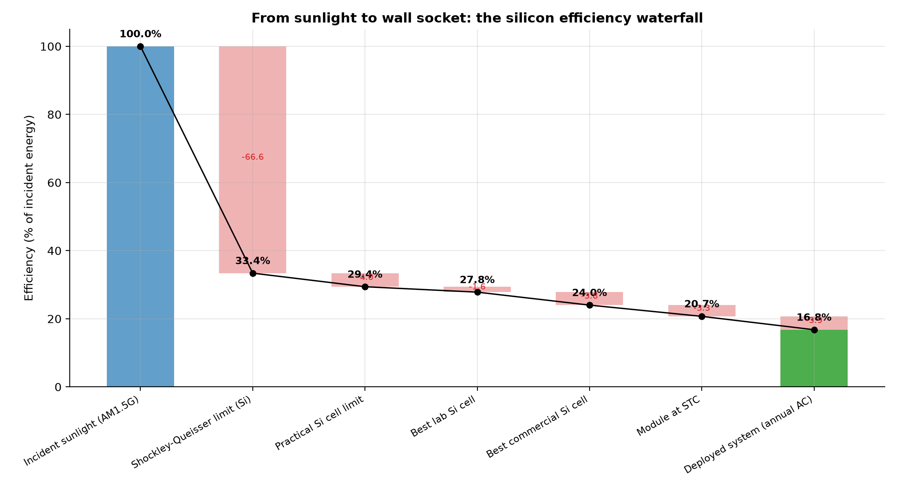
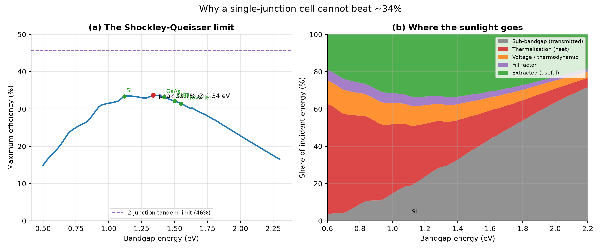
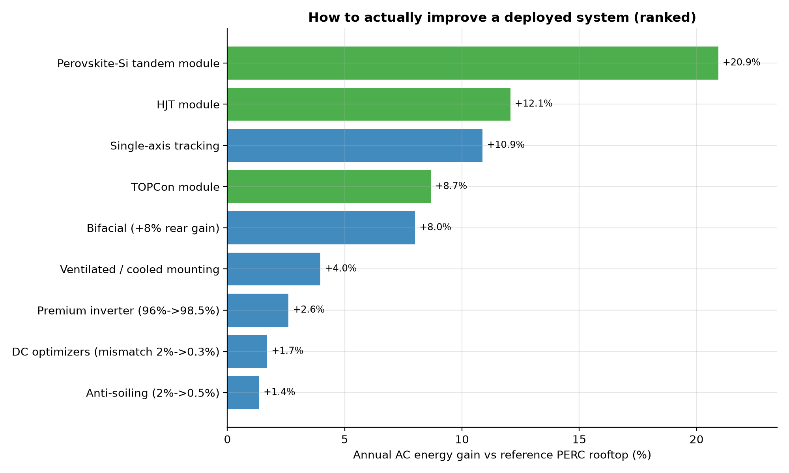
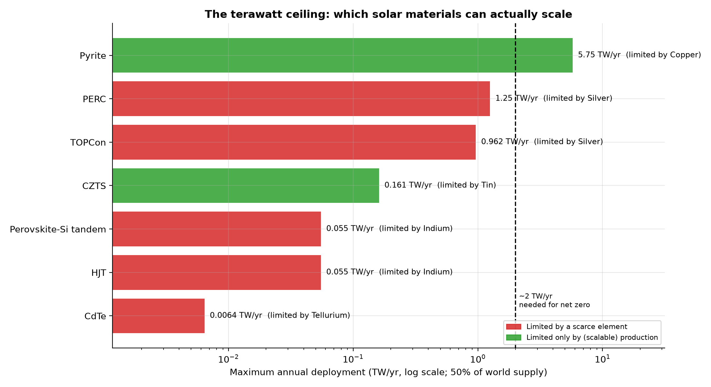
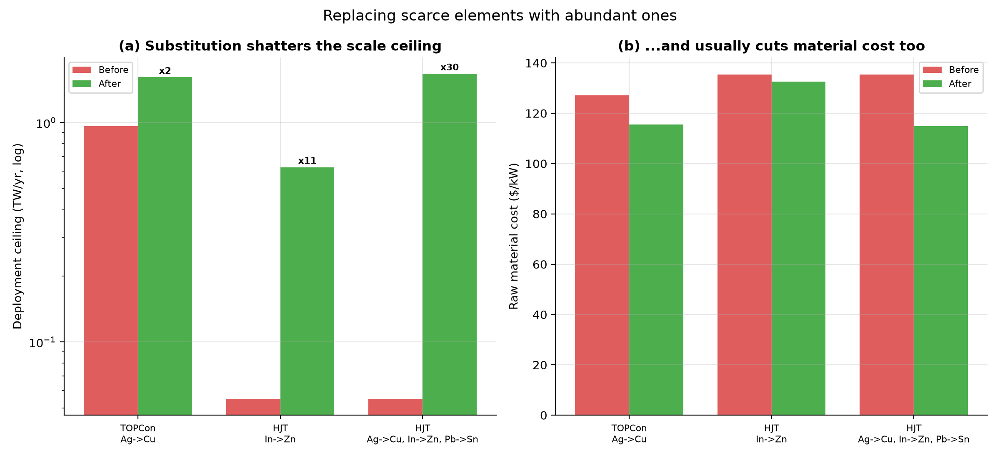
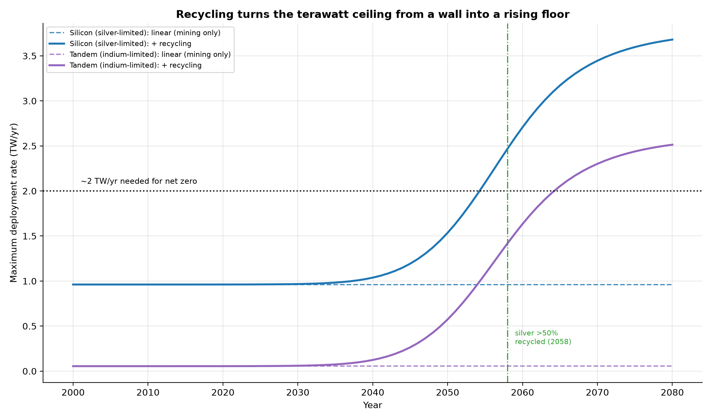
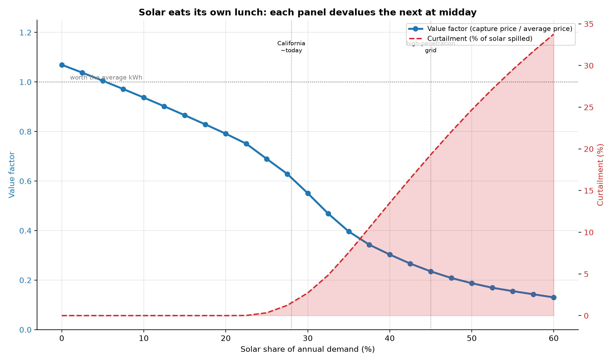
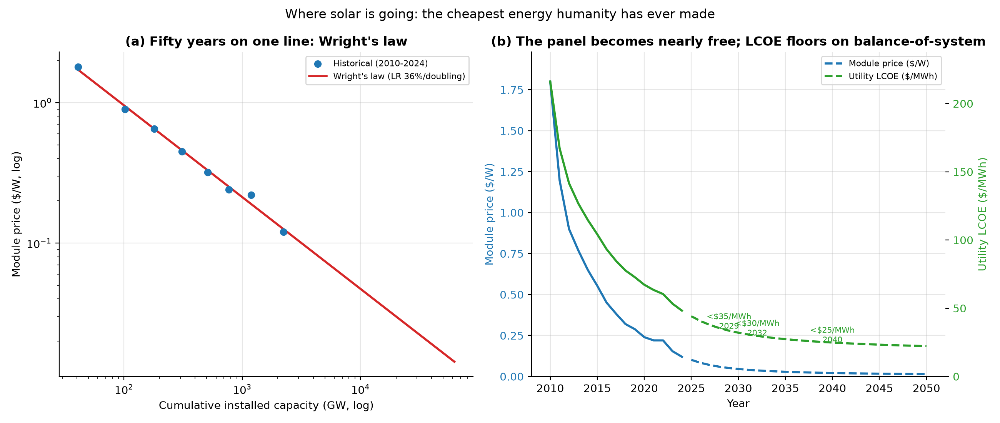

# solarlab — from "why are solar panels only ~20% efficient?" to changing the sphere of energy

A typical rooftop solar panel converts only about a fifth of the sunlight that
hits it into electricity. That question turned into eleven, each answered from
first principles — the toolkit *computes* the physics and economics rather than
quoting them — and generates eleven cited reports with 25 figures. Every number is
calculated here or carried with its source.

The arc: the binding constraint on solar keeps moving — **efficiency → cost →
materials → value/timing → end-use** — and the project follows it all the way to
"The Great Inversion": solar has won on cost, so the future is about reshaping
demand around the sun, not the sun around demand.

**New here?** Start with [`PROJECT_REPORT.md`](PROJECT_REPORT.md) — a plain-language
tour of everything this project discovered, written for someone with no background
in solar. No jargon, no math required.

```bash
pip install -e ".[dev]"
python -m solarlab report       # Part I:    efficiency physics   -> REPORT.md + figs 1-5
python -m solarlab economics    # Part II:   cost & materials     -> REPORT_ECONOMICS.md + figs 6-10
python -m solarlab circularity  # Part III:  recycling            -> REPORT_CIRCULARITY.md + figs 11-13
python -m solarlab land         # Part IV:   land use / dual-use  -> REPORT_LAND.md + figs 14-15
python -m solarlab optimize     # Part V:    the optimiser        -> REPORT_OPTIMIZER.md + fig 16
python -m solarlab pyrite       # Part VI:   the pyrite problem   -> REPORT_PYRITE.md + fig 17
python -m solarlab value        # Part VII:  the value of time    -> REPORT_VALUE.md + figs 18-19
python -m solarlab firming      # Part VIII: firm 24/7 solar      -> REPORT_FIRMING.md + figs 20-21
python -m solarlab power2x      # Part IX:   solar-to-molecules   -> REPORT_POWER2X.md + figs 22-23
python -m solarlab space        # Part X:    space-based solar    -> REPORT_SPACE.md + fig 24
python -m solarlab future       # Part XI:   trajectory + manifesto -> REPORT_FUTURE.md + fig 25
python -m solarlab metal        # Part XII:  copper vs silver       -> REPORT_METAL.md + fig 26
python -m solarlab renewable    # Part XIII: truly renewable?       -> REPORT_RENEWABLE.md + fig 27
python -m solarlab pyrite       # Part XIV:  pyrite voltage roadmap -> (+ fig 28 in REPORT_PYRITE.md)
python -m solarlab spacedeep    # Part XV:   space solar, seriously -> REPORT_SPACEDEEP.md + fig 29
python -m solarlab collection   # Part XVI:  the collection problem  -> REPORT_COLLECTION.md + fig 30
python -m solarlab all          # every report, all 30 figures
pytest                          # 185 tests pin the numbers to published values

# the optimiser is also an interactive tool:
python -m solarlab optimize --area 40 --budget 80000 --deployment residential
```

## The short answer

The "~20%" is not one failure but a chain of them, and **only the first rung is
fundamental physics** — everything below it is engineering, and therefore
improvable:

| Stage | Efficiency | What limits it |
|---|---|---|
| Shockley-Queisser limit (silicon) | **33.4%** | sub-bandgap + thermalisation + voltage + fill-factor |
| Practical silicon cell limit | 29.4% | intrinsic Auger recombination |
| Best lab silicon cell | 27.8% | surface/contact recombination, resistance |
| Best commercial module | ~20.7% | cell-to-module packaging |
| **Deployed system (annual AC)** | **~16.8%** | temperature, soiling, wiring, inverter |



A perfect *single-junction* cell simply cannot beat ~34%: photons below the
bandgap pass through, and the energy of photons above it is lost as heat. These
two losses pull in opposite directions, which is why the limit peaks near
1.34 eV (33.7%) and silicon sits at 33.4%.



## How to actually improve it

The toolkit simulates a real rooftop (pvlib, a full 8760-hour year) and ranks
concrete improvements by the extra annual energy each delivers. The standout is
the **tandem cell** — the one lever that raises the cell's *physical ceiling*
rather than recovering system losses, and it is moving from lab to market now.
Perovskite-on-silicon tandems have already passed silicon's single-junction
limit, reaching 35% in the laboratory.



The strategy to change the energy industry is two-front: **push multi-junction
cells to break the physics ceiling**, and **deploy the proven system
engineering** (tracking, bifaciality, cooling, better power electronics) that
stops us wasting what today's cells already make. And because the industry's
real objective is cost per kilowatt-hour, a cheaper 20% panel often beats a
pricier 24% one — efficiency matters most where area or weight is scarce.

See [`output/REPORT.md`](output/REPORT.md) for the full analysis.

## Part II — dollars, space, and the materials ceiling

Efficiency is a vanity metric; the world buys energy in dollars per kilowatt-hour
and, at terawatt scale, in *grams of scarce element per watt*. The second half of
the toolkit (`python -m solarlab economics`) computes:

- **LCOE** that reproduces Lazard 2025 (utility **$56/MWh**, residential
  **$176/MWh**) — and shows energy cost is set by *where* you deploy, not which
  cell. On a roof, **soft costs dominate**, so a better cell barely moves the bill.
- **The cost/space/scale frontier** — efficiency mainly buys *energy density*
  (kWh/m²), which only pays off where area is scarce.
- **The terawatt ceiling** — the constraint no efficiency chart shows. Dividing
  world production of each scarce element by how much each technology needs:



CdTe is tellurium-limited to **0.006 TW/yr**, heterojunction and perovskite
tandems are indium-limited to **0.055 TW/yr**, and even mainstream silicon is
**silver-limited to ~1.2 TW/yr** — against a need of very roughly **2 TW/yr**.

- **Material substitution as the breakthrough lever.** Swapping silver for
  electroplated **copper** (1/95th the price, ~900× the supply) and indium for
  **zinc** (AZO) lifts the scaling ceiling up to **30×**, while *lowering* material
  cost. The boldest absorbers — kesterite (Cu-Zn-Sn-S) and iron pyrite (FeS₂,
  "fool's gold") — abandon scarce elements entirely.



The thesis: a *good-enough, abundant, cheap* cell may matter more to
decarbonisation than a record-efficiency scarce one — because we can actually
build 50 TW of it. Full write-up in [`output/REPORT_ECONOMICS.md`](output/REPORT_ECONOMICS.md).

## Part III — circularity turns the ceiling into a moving target

The terawatt ceiling assumes every watt is freshly mined. But every panel
installed today retires in ~30 years as feedstock. A dynamic material-flow model
(`python -m solarlab circularity`) of the global fleet — install cohorts retiring
on an IRENA Weibull survival curve — shows the scarce-element ceiling *rising over
time* as recovered metal adds to supply:



The nuanced, honest finding: **recycling lags the growth phase** (recovered metal
comes from the small installs of 30 years ago, ~20% of demand by 2050) but
**secures the steady state** — silver crosses 50% recycled content around 2058 and
the ceiling climbs past the net-zero need. The catch: only **high-value recycling**
(FRELP/hydrometallurgical, recovering 94% of silver and 95% of silicon) closes the
loop; standard mechanical recycling throws both away. Build it *before* the
retirement wave. Full write-up in [`output/REPORT_CIRCULARITY.md`](output/REPORT_CIRCULARITY.md).

## Part IV — optimising for space: land, dual-use, grid value

Module efficiency is energy per *panel* area; siting is about energy per *land*
area, and land can do two jobs (`python -m solarlab land`). The **Land Equivalent
Ratio** shows **agrivoltaics** (LER ~1.55) and **vertical bifacial east-west**
(LER ~1.81) out-produce single-use land — and vertical east-west shifts generation
off the midday glut to the valuable morning/evening shoulders. **Floating PV** uses
no land and gains ~3% from cooling. See [`output/REPORT_LAND.md`](output/REPORT_LAND.md).

## Part V — the optimiser: which cell wins, and why

`python -m solarlab optimize` turns the frontier into a decision and reports which
constraint binds. The optimal cell **flips**: when *area* binds, the most efficient
cell wins (tandem on a small roof); when *budget* binds, the cheapest cell wins
(PERC at utility scale gives the most capacity per dollar). There is no single
"best" cell — efficiency is worth paying for exactly when space, not money, is
scarce. See [`output/REPORT_OPTIMIZER.md`](output/REPORT_OPTIMIZER.md).

## Part VI — fool's gold: the pyrite voltage problem

Iron pyrite (FeS₂) is iron + sulfur — essentially unlimited — with a near-ideal
0.95 eV bandgap, yet makes a ~3% cell. A non-ideal extension of the
Shockley-Queisser model (`python -m solarlab pyrite`) pins the blame on a
catastrophic **voltage** deficit (external radiative efficiency ~1e-9 collapses Voc
to ~0.2 V). The prize: cure the surface defects to silicon-grade quality and pyrite
reaches **22–25%** — a cheap, infinitely-scalable cell. The physics permits 31%;
only the defects forbid it. See [`output/REPORT_PYRITE.md`](output/REPORT_PYRITE.md).

## Parts VII–XI — The Great Inversion: from cheap electrons to a new energy substrate

The first six parts optimise the *supply* of solar electrons. The 2026 frontier
says that problem is essentially solved — and a new one has taken its place. Solar
has **won the cost war but is losing the value war**: its electrons are cheapest
exactly when they're least valuable.

- **Part VII — the value of time.** An hourly market model shows solar's value
  factor collapsing as it scales (to ~0.55 at 30% penetration, matching California
  today), with curtailment climbing — the integration wall that LCOE hides.
  
- **Part VIII — firming.** Hourly battery dispatch puts dispatchable 24/7 solar at
  **~$59–72/MWh** (high-resource), beating new gas and coal — but the last few
  percent of reliability is a cost cliff.
- **Part IX — solar as feedstock.** The deepest reframe: stop storing electrons,
  start making molecules. Flexible electrolysis eats the curtailed glut (34%→12%)
  and near-free solar collapses the cost of hydrogen, ammonia, fuels, water, carbon
  removal and compute.
- **Part X — solar off-world.** Space-based solar runs ~95% capacity factor, so it
  competes with *firm* terrestrial solar; at Starship-class launch (~$100/kg) it
  reaches **$35–103/MWh** — a launch-cost bet, not a physics one.
- **Part XI — the trajectory & capstone.** Wright's law (fitted 36%/doubling,
  R²=0.994) drives the module toward near-free while LCOE floors on balance-of-
  system. The capstone manifesto ties all eleven parts into one argument about how
  solar changes civilization — with every step past the data flagged.



The through-line: **stop shaping solar to fit demand; start shaping demand to fit
the sun.** Full write-up in [`output/REPORT_FUTURE.md`](output/REPORT_FUTURE.md).

## Parts XII–XV — stress-testing the story

Four analyses that pressure-test the project's own claims:

- **Part XII — the copper question.** Modelling efficiency *and* longevity (not just
  cost), copper's LCOE edge over silver turns out razor-thin — a +0.05%/yr
  reliability slip erases it. Copper's real value is **abundance, not price**.
- **Part XIII — truly renewable?** A 50 TW silver fleet *without* recycling exhausts
  reserves in ~30 years; a tight recycling loop (metals refine back to full purity)
  stretches that to ~190 years, and copper makes it effectively infinite. Solar can
  be truly renewable — but only with **a closed loop *and* abundant metals**.
- **Part XIV — cracking pyrite.** A quantified voltage-repair roadmap: surface
  passivation → bulk control → carrier-selective contacts takes "fool's gold" from
  6% to 25%, turning a vague "what if" into measurable engineering targets.
- **Part XV — space solar, seriously.** Launch carbon pays back in ~3 months, but
  scaling to power the *whole* world needs ~240 rocket launches a day for 30 years.
  Verdict: a premium firm-power **slice**, not the bulk.
- **Part XVI — the collection problem.** A closed loop is worthless if the panels
  never come back. Below ~50% collection (most of the world is at ~10-20%) the
  material runway collapses to the no-recycling cliff; landfill is cheaper than
  recycling, and the copper transition thins the incentive further. The fix is
  **policy and logistics** (producer responsibility, deposits, landfill bans) — the
  least glamorous and possibly highest-leverage lever in the whole project.

## How it works

| Module | Role |
|---|---|
| `spectrum.py` | AM1.5G spectrum + fast wavelength-domain integrals |
| `sq.py` | Shockley-Queisser detailed-balance limit, losses, tandems |
| `history.py` | seven decades of cited efficiency records + trend analysis |
| `system.py` | explicit pvlib model chain + per-stage loss attribution |
| `levers.py` | one-change-at-a-time improvement simulator |
| `waterfall.py` | the sun → AC efficiency ladder |
| `economics.py` | LCOE, energy-per-dollar, sensitivity, Monte-Carlo |
| `materials.py` | material intensity, the terawatt ceiling, substitution |
| `frontier.py` | the cost / space / scale Pareto frontier |
| `circularity.py` | dynamic material-flow model: the urban mine, relaxed ceiling |
| `landuse.py` | land-use efficiency, Land Equivalent Ratio, diurnal grid value |
| `optimizer.py` | constrained pick of technology + deployment for a goal |
| `sq.py` (ERE) | non-ideal device model for the pyrite voltage problem |
| `value.py` | hourly value-of-solar / value-deflation model |
| `firming.py` | battery dispatch + levelized cost of firm 24/7 solar |
| `power2x.py` | green-hydrogen / power-to-X economics, demand inversion |
| `spacepv.py` | space-based solar launch-cost economics |
| `learning.py` | Wright's-law fit and cost trajectory to 2050 |
| `metallization.py` | copper-vs-silver efficiency/longevity/LCOE |
| `renewable.py` | closed-loop materials and the runway to "truly renewable" |
| `pyrite.py` | the pyrite voltage-repair roadmap |
| `spacedeep.py` | space-solar launch carbon, beaming chain, scalability |
| `collection.py` | end-of-life collection rate, recycling economics |
| `figures.py` / `report*.py` / `cli.py` | 30 figures, fifteen reports, entry point |

The physics is validated against published values: the 33.7% peak at 1.34 eV
(Rühle 2016), silicon's ~44 mA/cm² short-circuit current, the ideal two-junction
tandem near 46%, and a loss decomposition that sums to 100% to within 1e-9.

## Caveats

Detailed balance is an *upper bound* (unity quantum efficiency, radiative-only
recombination, one sun, 300 K), not a device simulation. The system model uses a
single TMY3 site and omits angle-of-incidence reflection, snow, and explicit
shading. Record efficiencies are tested by *range*, not exact value, because they
move — verify against the [NREL Best Research-Cell Efficiency chart](https://www.nrel.gov/pv/cell-efficiency.html).

## License

MIT.
