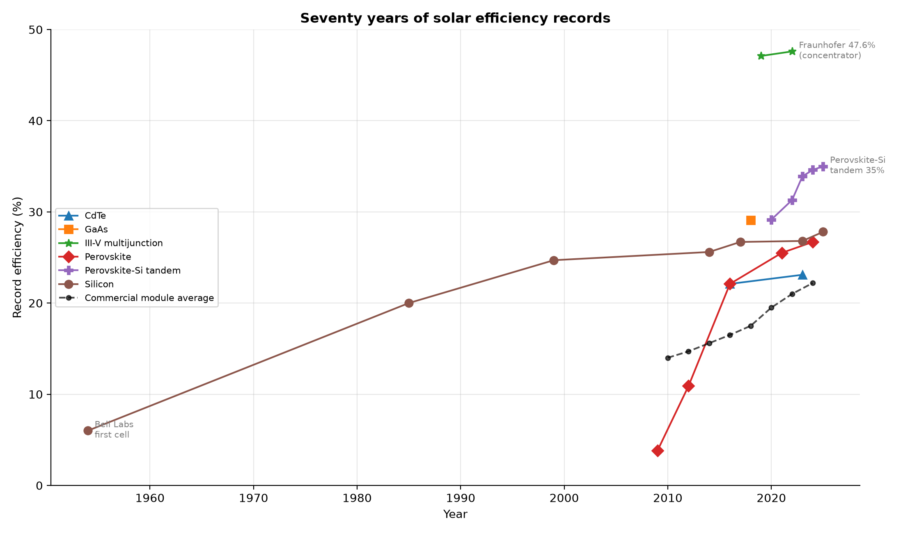
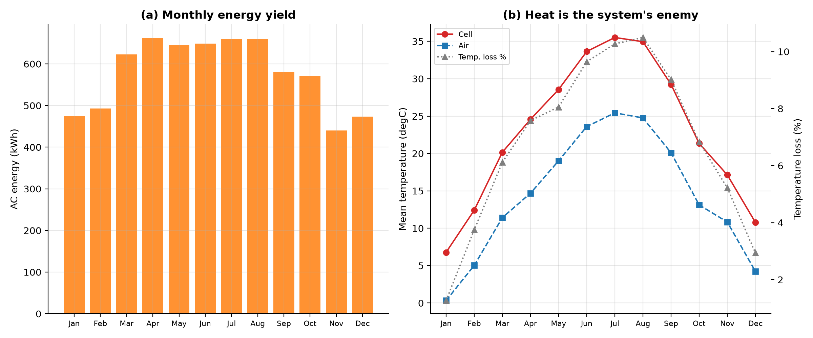

# Why Solar Panels Are Only ~20% Efficient — and How to Change That

*A first-principles analysis. Every number below is either computed by this
toolkit or carried with a citation. Regenerate with `python -m solarlab report`.*

Spectrum: **ASTM G173-03 AM1.5G (via pvlib)**. Reference site: **Greensboro, NC (TMY3 723170)**.
Data curated as of **2026-06**; check the NREL Best Research-Cell
Efficiency chart for newer records.

---

## 1. Executive summary — the five-number answer

A typical rooftop panel turns about a fifth of the sunlight that hits it into
electricity. That is not one failure but a *chain* of them, and only the first
is fundamental physics:

1. **The physics ceiling is ~34%, not 100%.** A perfect single-junction cell at
   the best bandgap is capped at **33.7%** (1.34 eV)
   by the Shockley-Queisser limit. Silicon sits at **33.4%**.
2. **Real silicon physics trims it to 29.4%** through
   unavoidable Auger recombination.
3. **The best laboratory cell reaches 27.81%**; the best
   *commercial* module about 20.7%.
4. **A deployed system delivers ~17% of incident energy as annual
   AC** (performance ratio 0.81) once temperature, soiling, wiring and
   inverter losses are counted — simulated here at 1386
   kWh/kWp.
5. **The biggest single lever today is the tandem cell.** Stacking a perovskite
   on silicon already beats silicon's single-junction limit in the lab
   (**35.0%**)
   and, in this simulation, a tandem module returns **+21%**
   more annual energy on the same roof.

The headline, then: ~20% is mostly *physics plus engineering maturity*, and the
path forward is **multi-junction cells to break the physics ceiling** plus
**well-understood system engineering** to stop losing what the cell already
makes.

---

## 2. The physics ceiling: detailed balance and the 34% limit

In 1961 Shockley and Queisser asked the cleanest possible question: ignore every
manufacturing defect — what is the *best a single-junction cell could ever do*?
Their answer follows from two facts. First, a semiconductor only absorbs photons
with energy above its bandgap `Eg`. Second, a cell warm enough to work must also
*emit* thermal radiation (detailed balance), which sets a hard floor on its dark
current and therefore a ceiling on its voltage.

Four unavoidable losses follow, shown for silicon (1.12 eV):

- **Sub-bandgap transmission — 19%:** photons redder than the
  bandgap pass straight through. Lowering the bandgap captures more of them...
- **Thermalisation — 32%:** ...but every photon *bluer*
  than the bandgap wastes its excess energy as heat. These two losses pull in
  opposite directions, and their tug-of-war is exactly why the efficiency curve
  has a peak near 1.3 eV.
- **Thermodynamic / voltage loss — 11%:** the
  open-circuit voltage is forced below `Eg/q` by the cell's own thermal emission.
- **Fill-factor loss — 5%:** the current-voltage curve is
  not a perfect rectangle.

What is left — **33%** for silicon — is the most a flawless
single-junction silicon cell could deliver. The toolkit computes these five
shares to sum to exactly 100% (checked to 1e-9). The single-junction optimum is
**33.7%** at 1.34 eV; GaAs (1.42 eV) reaches
**33.1%**.

**The way around the ceiling is to stop using one junction.** A two-junction
tandem — a wide-gap top cell over a narrow-gap bottom cell — splits the spectrum
and cuts both the sub-bandgap and thermalisation losses. The detailed-balance
limit for the ideal pair is **45.7%**
(1.60 eV / 0.94 eV), and this is no longer
theoretical: perovskite-on-silicon tandems have passed silicon's single-junction
limit in the laboratory.

---

## 3. From 33% to ~17%: the loss waterfall

Each rung below names what is lost reaching the next. The first drop is physics;
everything after it is engineering — which means everything after it is
*addressable*.

| Stage | Efficiency | Principal loss to next stage | Source |
| --- | --- | --- | --- |
| Incident sunlight (AM1.5G) | 100.0% | 100% of plane-of-array energy | ASTM G173-03 AM1.5G (reference spectrum) |
| Shockley-Queisser limit (Si) | 33.4% | sub-bandgap + thermalisation + voltage + fill-factor losses | Computed (detailed balance, this toolkit) |
| Practical Si cell limit | 29.4% | intrinsic Auger recombination | Richter, Hermle & Glunz 2013 (IEEE JPV) |
| Best lab Si cell | 27.8% | surface/contact recombination, series resistance | NREL Best Research-Cell Efficiency Chart 2026 |
| Best commercial Si cell | 24.0% | manufacturing tolerances vs the lab champion | ITRPV 2024 (TOPCon production class) |
| Module at STC | 20.7% | cell-to-module: glass reflection, gaps, interconnects | PERC module datasheet (LONGi Hi-MO 5 class) |
| Deployed system (annual AC) | 16.8% | temperature, soiling, mismatch, wiring, inverter, availability | Simulated, this toolkit (pvlib, Greensboro TMY3) |

---

## 4. Seventy years of progress (and why $/kWh, not %, is the real prize)

Silicon went from 27.8% in the lab while the commercial
fleet still averages 22.2% — a standing **5.6
percentage-point** lab-to-market gap. Progress by technology:

| Technology | First | First % | Latest | Latest % | pp/decade |
| --- | --- | --- | --- | --- | --- |
| III-V multijunction | 2019 | 47.1 | 2022 | 47.6 | 1.67 |
| Perovskite-Si tandem | 2020 | 29.1 | 2025 | 35.0 | 12.59 |
| GaAs | 2018 | 29.1 | 2018 | 29.1 | n/a |
| Silicon | 1954 | 6.0 | 2025 | 27.8 | 2.90 |
| Perovskite | 2009 | 3.8 | 2024 | 26.7 | 15.36 |
| CdTe | 2016 | 22.1 | 2023 | 23.1 | 1.43 |

But efficiency is only half the story. Between 2010 and 2024 module prices fell
from about \$1.80/W to
\$0.12/W while average efficiency
rose from 14% to
22%. The industry's true objective is
the **levelised cost of energy** (\$/kWh), and a cheaper 20% panel often beats a
pricier 24% one. Efficiency matters most where area is scarce (rooftops, vehicles)
or where it reduces every area-proportional balance-of-system cost at once.

---

## 5. A real rooftop, hour by hour

To get honest *system* numbers rather than datasheet ones, the toolkit simulates
a 5 kW close mount glass glass array for a full
8760-hour year at Greensboro, NC (TMY3 723170) (pvlib, Hay-Davies transposition, Sandia thermal
model, PVWatts losses).

- Plane-of-array irradiation: **1710 kWh/m²**
- Annual AC energy: **6,929 kWh** (1386 kWh/kWp)
- Performance ratio: **0.81**; effective system efficiency
  **16.8%**

| Stage | Energy (kWh) | % of POA-ideal | Loss |
| --- | --- | --- | --- |
| POA irradiance (module-plane, soiled) | 8,550 | 100.0% | reference: nameplate x insolation |
| DC after temperature | 7,936 | 92.8% | thermal: 7.2% (cell > 25C) |
| DC after array losses | 7,470 | 87.4% | mismatch+wiring+LID: 5.9% |
| AC after inverter + availability | 6,929 | 81.0% | inverter + availability |

Temperature is the quiet thief: cells run far hotter than the 25 °C of their
datasheet, and silicon loses roughly 0.34% of its power per degree above it —
worst exactly when the sun is strongest.

---

## 6. How to actually improve efficiency

Ranking concrete changes to the reference system by the extra annual energy each
delivers (technology swaps compared on a **fixed roof area**, so a better module
simply fits more watts on the same roof):

| Lever | Annual energy gain | What it changes | Source |
| --- | --- | --- | --- |
| Perovskite-Si tandem module | +20.9% | emerging cell technology; same roof area, nameplate 5.92 kW | Oxford PV commercial tandem module class |
| HJT module | +12.1% | premium cell technology; same roof area, nameplate 5.51 kW | REC Alpha Pure-R heterojunction datasheet |
| Single-axis tracking | +10.9% | ground-mount single-axis horizontal tracker, backtracking | Energy gain typical +15-25% (NREL PVWatts / literature) |
| TOPCon module | +8.7% | mainstream cell technology; same roof area, nameplate 5.39 kW | Jinko Tiger Neo N-type TOPCon datasheet |
| Bifacial (+8% rear gain) | +8.0% | rear-side irradiance gain, mid-range albedo | Bifacial gain 5-15% (Fraunhofer ISE / literature) |
| Ventilated / cooled mounting | +4.0% | open-rack airflow lowers cell temperature vs close roof mount | Sandia SAPM thermal coefficient sets (King et al. 2004) |
| Premium inverter (96%->98.5%) | +2.6% | higher nominal inverter efficiency | Modern string inverter CEC efficiency ~98.5% |
| DC optimizers (mismatch 2%->0.3%) | +1.7% | module-level power electronics cut array mismatch | Mismatch reduction with MLPE (literature) |
| Anti-soiling (2%->0.5%) | +1.4% | hydrophobic coating / cleaning reduces soiling loss | Soiling loss typical 2% baseline (Dobos 2014 PVWatts) |

**Reading the ranking:**

- **Tandems are the structural breakthrough.** They are the only lever that
  raises the *cell's* ceiling rather than recovering system losses, and they are
  moving from lab to market now. This is where efficiency-limited research should
  concentrate.
- **Tracking and bifaciality** are large, mature gains for ground-mounted plant.
- **Cooling, anti-soiling, better inverters and module-level electronics** are
  smaller but cheap, reliable, and additive — collectively a meaningful slice of
  the 83 points lost between the module rating and delivered AC.

If the goal is to change the energy industry, the two-front strategy is clear:
**push multi-junction cells to break the 34% physics ceiling**,
and **deploy the boring, proven system engineering** that stops us wasting what
today's cells already produce.

---

## 7. Assumptions and limitations

- Detailed-balance model assumes unity quantum efficiency, radiative-only
  recombination, a single sun, and a 300 K cell; it is an *upper bound*, not a
  device simulation.
- The tandem model is two-terminal, series-constrained, and ignores luminescent
  coupling, so its limit is conservative.
- The system simulation omits angle-of-incidence/IAM reflection, snow, and
  explicit shading; bifacial and availability gains are applied as constant
  factors; one TMY3 site stands in for "a rooftop".
- Record efficiencies are curated with citations and tested by *range*, not exact
  value, because records move. Verify against the NREL chart.

## 8. References

- W. Shockley & H. J. Queisser, *Detailed Balance Limit of Efficiency of p-n
  Junction Solar Cells*, J. Appl. Phys. 32, 510 (1961).
- S. Rühle, *Tabulated values of the Shockley-Queisser limit for single junction
  solar cells*, Solar Energy 130, 139 (2016).
- A. Richter, M. Hermle & S. W. Glunz, *Reassessment of the Limiting Efficiency
  for Crystalline Silicon Solar Cells*, IEEE J. Photovoltaics 3(4), 2013.
- A. P. Dobos, *PVWatts Version 5 Manual*, NREL/TP-6A20-62641, 2014.
- NREL, *Best Research-Cell Efficiency Chart* (2026).
- Fraunhofer ISE, *Photovoltaics Report* (2024); ITRPV roadmap.
- W. F. Holmgren et al., *pvlib python*, J. Open Source Software 3(29), 884 (2018).
