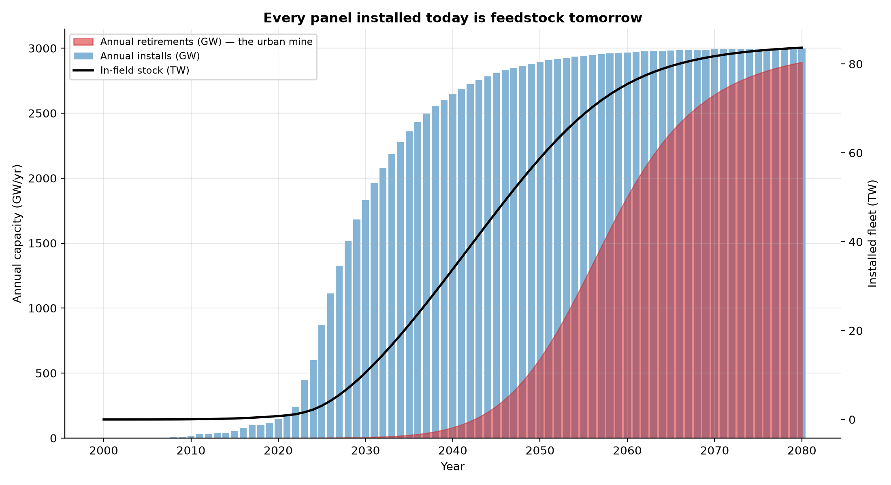
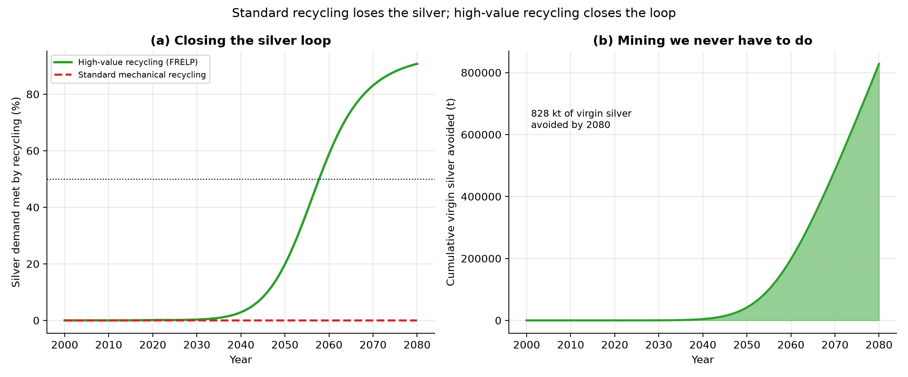

# Circularity: Recycling Turns the Terawatt Ceiling Into a Moving Target

*Part III of the solar analysis. [Part II](REPORT_ECONOMICS.md) showed that
scarce elements — silver, indium, tellurium — cap how fast solar can scale. But
that ceiling assumes every watt is built from freshly-mined metal. This part adds
the missing dimension: **time and recycling.** Every panel installed today is an
ore body waiting two or three decades to be mined again.*

*All figures come from a dynamic material-flow model of the global fleet (install
cohorts retiring on a Weibull survival curve), validated against IRENA's
end-of-life projections. Horizon: 2080.*

---

## 1. Executive summary

- **The ceiling rises.** With high-value recycling, silicon's silver-limited
  deployment ceiling climbs from a flat **0.96 TW/yr** (mining only)
  to **1.54 TW/yr by 2050** and **3.7 TW/yr by
  2080** — recovered silver simply adds to supply.
- **But recycling lags growth.** While deployment is still rising exponentially,
  recovered metal (from the small installs of ~30 years ago) can only meet
  **~20%** of silver demand by 2050. Recycling does not rescue
  the *growth* phase — it secures the *steady state*. Silver crosses 50% recycled
  content around **2058**, once deployment matures.
- **The urban mine is enormous.** Cumulative retired-panel mass reaches
  **~222 Mt by 2050** in this trajectory (62 TW
  installed) — several times IRENA's 2016 estimate of 78 Mt, because deployment
  has far outpaced what was foreseen then.
- **Process choice is everything.** Standard mechanical recycling recovers the
  glass and aluminium frame but **throws the silver and silicon away**. Only
  high-value recycling (FRELP / hydrometallurgical) closes the loop on the
  elements that actually constrain scale.

The reframe: at steady state, a mature PV industry is **materially circular** —
it mines its own retired fleet. The scarce-element ceiling is therefore a
*transient* constraint of the growth era, not a permanent wall — provided we
build high-value recycling now, ahead of the retirement wave.

---

## 2. The urban mine: a stock-and-flow model

Panels installed in year *y* retire gradually, following the IRENA/IEA-PVPS
Weibull survival curve (30-year nominal life, shape 5.38). The fleet's in-field
*stock* and annual *retirements* follow from convolving the install history with
that curve. The result is the figure above: a retirement wave that is negligible
today but becomes a torrent of feedstock from the 2040s onward.

By 2050 the cumulative retired mass is **~222 Mt** — an "urban
mine" of glass, aluminium, silicon, copper and silver. IRENA valued the 2050
stock (on 2016 deployment assumptions, ~78 Mt) at over US$15 billion; today's
much larger trajectory scales that prize up several-fold.

---

## 3. Standard vs high-value recycling — why the process matters

Not all recycling is equal. The cheap, common path shreds the module and
recovers bulk commodities; the valuable cell metals are lost. High-value
processes (FRELP, hydrometallurgical/electrochemical) recover them:

| Element | Standard recycling | High-value (FRELP) |
| --- | --- | --- |
| Aluminum | 95% | 99% |
| Copper | 50% | 99% |
| Glass | 90% | 98% |
| Indium | 0% | 85% |
| Lead | 0% | 95% |
| Silicon | 0% | 95% |
| Silver | 0% | 94% |
| Tellurium | 0% | 90% |

The two rows that matter are **silver and silicon** — zero under standard
recycling, 94–95% under FRELP. Those are exactly the elements that set silicon
PV's cost and scaling limits. Recovering aluminium and glass is good for landfill
diversion; recovering silver is what relaxes the terawatt ceiling.

By 2080, in an all-silicon counterfactual at today's silver intensity,
high-value recycling avoids mining roughly
**828 kilotonnes of virgin silver** — metal that
simply never has to be dug up. Under standard recycling that number is zero.

---

## 4. The relaxed ceiling

Adding recovered metal to mined supply lifts the deployment ceiling year on year.
The flat dashed lines are the linear (mining-only) ceilings from Part II; the
solid lines add recycling:

Silicon's silver ceiling rises past the ~2 TW/yr
net-zero need as the retirement wave builds. The indium-limited tandem ceiling
relaxes too, but later — there are almost no tandems deployed yet to retire, so
its urban mine is decades away. The policy implication is sharp: **build the
high-value recycling capacity *before* the wave arrives**, or the metal is
landfilled and the ceiling stays a wall.

---

## 5. Assumptions and limitations

- One Weibull lifetime curve (regular-loss, 30-yr) stands in for a diverse fleet;
  early-loss failures would pull retirements forward.
- The material-flow counterfactual applies the *whole* fleet's retirements to a
  single technology's bill of materials ("if the fleet were all TOPCon / all
  tandem") — a clean comparison, not a mixed-fleet forecast.
- Recovery efficiencies are best-demonstrated values (FRELP pilot /
  hydrometallurgical lab); real collection rates are well below 100% today, so
  these are an upper bound on what recycling *could* contribute.
- The deployment projection is one scenario (~62 TW by 2050); the
  qualitative conclusion — recycling lags growth, then dominates at steady
  state — holds across scenarios.

## 6. References

- IRENA & IEA-PVPS, *End-of-Life Management: Solar Photovoltaic Panels*, 2016
  (Weibull lifetime parameters; ~78 Mt / US$15 bn by 2050).
- JRC / Sasil, *FRELP — Full Recovery End-of-Life Photovoltaic* (recovery
  efficiencies: glass 98%, Al 99%, Si 95%, Cu 99%, Ag 94%).
- Hydrometallurgical/electrochemical silver recovery literature (Ag >98%).
- IEA, *Net Zero Roadmap*; IRENA 1.5C scenario (deployment trajectory).
- U.S. Geological Survey, *Mineral Commodity Summaries 2025* (primary production).
