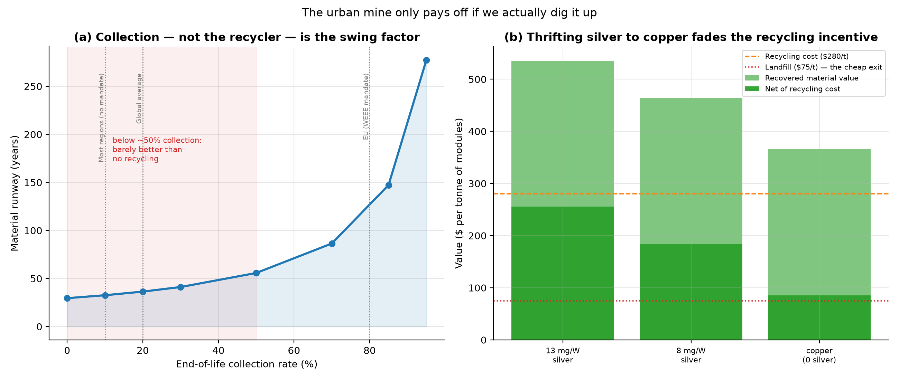

# The Collection Problem: The Urban Mine Only Counts If We Dig It Up

*Part XVI — the least glamorous and possibly most important analysis in the project.
Part XIII proved solar can be materially renewable with a tight recycling loop. But
"the loop" quietly assumed we **collect** ~90% of retired panels. We don't —
globally, formal collection is in the low tens of percent. This part makes
collection the variable it really is, and the result reframes recycling from a
technology problem into a **logistics and policy** problem.*

---

## 1. Collection, not the recycler, is the binding constraint

Hold the recycler at best practice (95% recovery, 99% refining) and vary only how
many retired panels actually reach it:

| Collection rate | Loop closed | Virgin metal (% of world prod.) | Runway |
| --- | --- | --- | --- |
| 0% | 0% | 87% | 30 yr |
| 20% | 19% | 70% | 36 yr |
| 50% | 47% | 46% | 56 yr |
| 85% | 80% | 17% | 147 yr |
| 95% | 89% | 9% | 277 yr |

The curve is brutal in its honesty. Below about **50% collection — which is where
most of the world sits today** — the loop leaks so badly that the multi-century
runway of Part XIII collapses back toward the ~30-year no-recycling cliff. At a
realistic **global ~20%** collection rate, the runway is just **36
years** and fresh mining still swallows **70%**
of world silver production. Push collection to **85%** (the EU's WEEE mandate level)
and it leaps to **147 years**.

The uncomfortable implication: **the world's best recycling technology is worthless
on a pile of panels nobody collected.** All the elegant chemistry of Part III, all
the closed-loop math of Part XIII, hinges on a mundane question — does the dead
panel get picked up, or dumped?

## 2. The economics quietly push the wrong way

Why is collection so low? Because the disposer's incentives point at the landfill.
A tonne of retired modules holds about **$536** of recoverable
material, and high-value recycling costs about **$280/tonne** — so
recovery is genuinely **net-positive (~$256/tonne)**. But the person
holding the panel doesn't see that value; they see a choice between *paying*
$280 to recycle or $75 to landfill. **Landfill
is $205/tonne cheaper**, so unless the recovered value is captured
by whoever pays — or a law forbids the landfill — the panel gets dumped.

## 3. The cruel twist: copper makes it worse

And here is the sharp interaction that ties this part to Part XII. The reason a
retired panel is worth recovering at all is mostly the **silver** inside it. As the
industry thrifts silver down and switches to **copper** metallisation — exactly the
move that fixes the supply ceiling (Parts II, XII) — the recoverable value falls:

- Today (13 mg/W silver): ~$536/tonne, net ~$256.
- Copper era (no silver): ~$366/tonne, net ~$86.

So the very transition that makes solar *scalable* makes its panels *less worth
recycling* — the recovery margin shrinks by two-thirds. **The copper era will need
more policy to drive collection, not less.** Solving the supply problem quietly
deepens the collection problem.

## 4. What actually fixes it

The good news: this is a solved problem in principle, with a working precedent.

- **Extended Producer Responsibility (EPR).** Make the manufacturer responsible for
  the panel's end of life. The EU's WEEE directive already covers PV and drives
  ~80% collection — which, the curve above shows, is the difference between a
  30-year cliff and a 150-year runway.
- **Deposit / take-back schemes.** A refundable fee at sale that is repaid on
  return turns the disposer's incentive from "dump it cheaply" to "claim my deposit".
- **Design for disassembly.** Panels built to come apart (recyclable encapsulants,
  separable frames) cut the recycling cost, widening the net-positive margin.
- **Mandated landfill bans** for PV, closing the cheap exit entirely.

None of these are technologies. They are **rules and logistics** — and they are the
cheapest, highest-leverage climate intervention hiding in this entire project. We
spent fifteen parts on physics, cost, materials, and orbits. The thing most likely
to decide whether solar is *truly* renewable is whether a truck shows up to collect
the old panels.

## 5. Assumptions and limitations

- Collection rates are representative; precise figures vary by region and year, and
  "collection" blurs into reuse/export (which often just defers the problem).
- Recovered-material values use discounted recovered prices; recycling and landfill
  costs are mid-range estimates that vary widely by location and process.
- The steady-state fleet framing follows Part XIII; during growth the picture is
  tighter still.

## 6. References

- IRENA & IEA-PVPS, *End-of-Life Management: Solar PV Panels* (collection, value).
- EU WEEE Directive (PV included); extended-producer-responsibility literature.
- Global e-waste collection statistics (the low-tens-of-percent reality).
