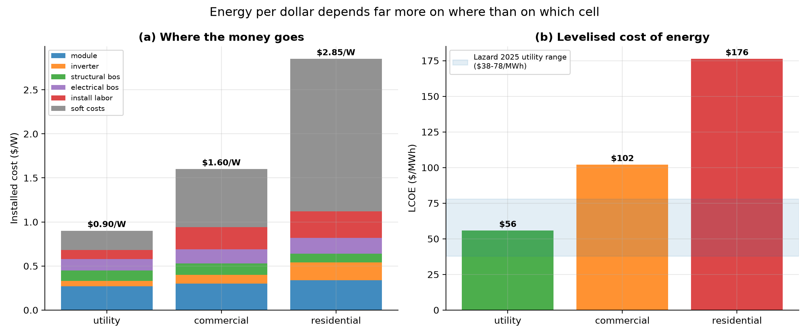
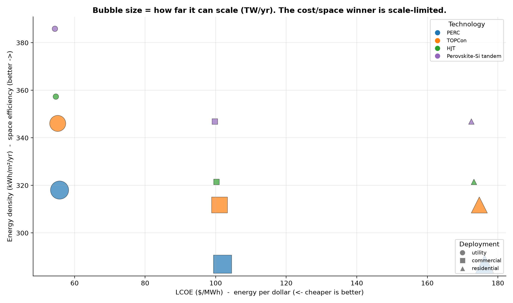
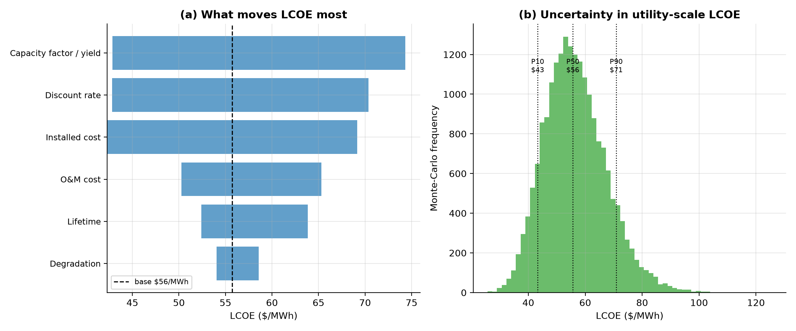

# The Economics and Materials of Terawatt-Scale Solar

*Part II of the solar analysis. Where [Part I](REPORT.md) asked why panels are
only ~20% efficient, this asks the questions that actually decide the energy
transition: **how do we maximise energy per dollar and per square metre — and
can we even get the materials to build solar at the scale the planet needs?**
Every number is computed by this toolkit or carried with a citation.*

---

## 1. Executive summary — the reframe

Three findings reorder the usual priorities:

1. **Energy per dollar is set by *where*, not *which cell*.** Utility-scale solar
   here delivers **$56/MWh**; the identical cells on a roof cost
   **$176/MWh** — because soft costs, not silicon, dominate a rooftop
   install. The cell technology barely moves LCOE within a deployment.
2. **Efficiency mostly buys *space*, not cheaper energy.** Among silicon cells at
   one site, LCOE is nearly flat; what a better cell buys is energy density
   (kWh per m²). That only converts to dollars where area is scarce — rooftops,
   vehicles, balconies.
3. **The real ceiling is the periodic table.** At terawatt scale the binding
   constraint is grams of a scarce element per watt. Today's silicon cells are
   **silver-limited to ~1.2 TW/yr**; CdTe is tellurium-limited
   to **0.0064 TW/yr**. The fix is not efficiency — it is
   **substituting abundant elements**, which lifts the ceiling by
   **30x** in the boldest case modelled here.

The provocative conclusion: a slightly-less-efficient cell made of iron, copper
and sulfur may matter more to decarbonisation than a record-breaking one made of
silver, indium and tellurium — because we can actually build 50 TW of it.

---

## 2. What actually drives the cost of solar energy

LCOE discounts every future kilowatt-hour and dollar to install day. The cost
*stack* explains the surprise that the same panel yields wildly different energy
costs:

| Deployment | Installed $/W | LCOE ($/MWh) | kWh per $ (30 yr) |
| --- | --- | --- | --- |
| utility | $0.90 | $56 | 48 |
| commercial | $1.60 | $102 | 24 |
| residential | $2.85 | $176 | 14 |

For utility plants, hardware dominates and the result (**$56/MWh**)
sits squarely in Lazard's 2025 unsubsidised range of $38-78/MWh. For residential,
**soft costs** — sales, permitting, overhead, margin — are the single biggest
line, which is why making the *cell* cheaper or better does little for a rooftop
system's economics. If you want to change the cost of household solar, attack
paperwork and customer-acquisition, not the bandgap.

---

## 3. Energy per dollar *and* per square metre: the frontier

Plotting every technology and deployment on two axes at once — energy per dollar
(LCOE) and energy per unit area (density) — reveals the trade-off. Bubble size is
the third objective: how far each option can scale.

On cost-vs-space alone, the Pareto winner is **Perovskite-Si tandem** at
**utility** scale ($54/MWh,
386 kWh/m²/yr) — highest efficiency, lowest
cost. But its bubble is tiny: it is indium-limited. **Once scalability is added
as a third objective, the frontier readmits the high-ceiling silicon cells
(PERC, TOPCon)** — the abundant, scalable workhorses you would actually deploy by
the terawatt, even though they concede a little on cost and density. The lesson:
the cost/space optimum and the scale optimum are different points, and reconciling
them is a *materials* problem.

---

## 4. The terawatt ceiling — the constraint no efficiency chart shows

To hold warming down, the world needs to build on the order of
~2 TW of solar per year, sustained for decades. Can the
mines keep up? For each technology, divide the world's annual production of its
scarcest ingredient (allowing PV half of it) by how many grams that technology
needs per watt:

| Technology | Ceiling (TW/yr) | Limited by | Scarce? |
| --- | --- | --- | --- |
| CdTe | 0.0064 | Tellurium | yes |
| HJT | 0.055 | Indium | yes |
| Perovskite-Si tandem | 0.055 | Indium | yes |
| CZTS | 0.161 | Tin | no (scalable) |
| TOPCon | 0.962 | Silver | yes |
| PERC | 1.25 | Silver | yes |
| Pyrite | 5.75 | Copper | no (scalable) |

The numbers are stark. **Tellurium** caps CdTe at a few gigawatts a year —
which is exactly why it remains a niche despite being cheap and bankable.
**Indium** caps heterojunction and perovskite tandems similarly. Even mainstream
silicon is **silver-limited to ~1.2 TW/yr** — uncomfortably close
to today's build rate, which is why the industry is racing to thrift silver. The
green bars are technologies limited only by elements we can mine more of
(silicon, copper, iron): their ceiling is a factory-building problem, not a
geological one.

---

## 5. Breaking the ceiling — abundant-element substitution

This is the outside-the-box lever. Swap the scarce element for an abundant one
and re-run the arithmetic:

| Technology | Was limited by | Was (TW/yr) | Now limited by | Now (TW/yr) | Scale-up |
| --- | --- | --- | --- | --- | --- |
| TOPCon | Silver | 0.962 | Silicon | 1.61 | 2x |
| HJT | Indium | 0.055 | Silver | 0.625 | 11x |
| HJT | Indium | 0.055 | Silicon | 1.67 | 30x |

- **Silver → electroplated copper.** Copper costs ~1/95th of silver and the world
  mines ~900x more of it. Replacing silver metallization moves silicon's binding
  constraint off silver entirely (to Silicon), and *lowers*
  material cost. This is not speculative — Fraunhofer ISE and others have
  demonstrated copper-plated cells using a tenth of the silver.
- **Indium (ITO) → aluminium-doped zinc oxide (AZO).** Removes the indium wall
  that throttles heterojunction and tandem cells; zinc is ~10,000x more abundant.
- **Going fully abundant** (copper + zinc + tin perovskite) lifts the
  heterojunction ceiling by **30x**.

And the boldest absorbers abandon the scarce elements altogether: **kesterite
(Cu-Zn-Sn-S)** and even **iron pyrite (FeS₂, "fool's gold")** are built from some
of the most common elements in the crust. They are less efficient and less mature
today — pyrite especially is a research-stage gamble on voltage — but their
abundance ceiling is effectively unlimited. For a planet that needs tens of
terawatts, "good enough and infinitely scalable" can beat "excellent and capped."

---

## 6. How we simulated it, and how sure we are

LCOE for the headline utility case is **$56/MWh**, but the inputs are
uncertain. A one-at-a-time sensitivity and a 20,000-run Monte-Carlo (varying cost,
yield, discount rate, degradation and O&M) give the spread:

- Sensitivity ranks the drivers; **installed cost, cost of capital, and capacity
  factor** dominate — not the cell.
- Monte-Carlo P10/P50/P90 = **$43 / $56 / $71/MWh**.

---

## 7. Assumptions and limitations

- LCOE uses a single-site yield (Greensboro TMY3) and generic NREL cost stacks;
  real projects vary with resource, labour, and finance. The model reproduces
  Lazard's utility range, which is the validation.
- The **material ceiling** is deliberately simple: annual production x an
  assumed 50% PV share / intensity. It ignores recycling, reserve growth,
  substitution within an element's other markets, and price-elastic supply. It is
  an order-of-magnitude scaling argument, not a forecast — but the order of
  magnitude is the whole point.
- Substitutions assume the replacement element deposits at comparable mass; thin-
  film processing costs are not captured beyond raw materials. Efficiencies for
  kesterite and pyrite are research-stage and shown for their abundance, not as
  bankable products.
- Material intensities are ITRPV/literature mid-points; element data are USGS
  Mineral Commodity Summaries 2025. Records and prices move — verify before use.

## 8. References

- Lazard, *Levelized Cost of Energy+ (LCOE+)*, June 2025.
- A. P. Dobos, *PVWatts Version 5 Manual*, NREL/TP-6A20-62641, 2014.
- NREL, *U.S. Solar Photovoltaic System Cost Benchmarks*, Q1 2024.
- U.S. Geological Survey, *Mineral Commodity Summaries 2025* (silver, tellurium,
  indium, copper, tin, zinc, etc.).
- ITRPV, *International Technology Roadmap for Photovoltaic*, 2024 edition
  (silver intensity and roadmap).
- Fraunhofer ISE, *Silicon heterojunction cells with record silver savings* (2025);
  copper-plating literature.
- IEA, *Net Zero Roadmap*; IRENA deployment scenarios (terawatt context).
