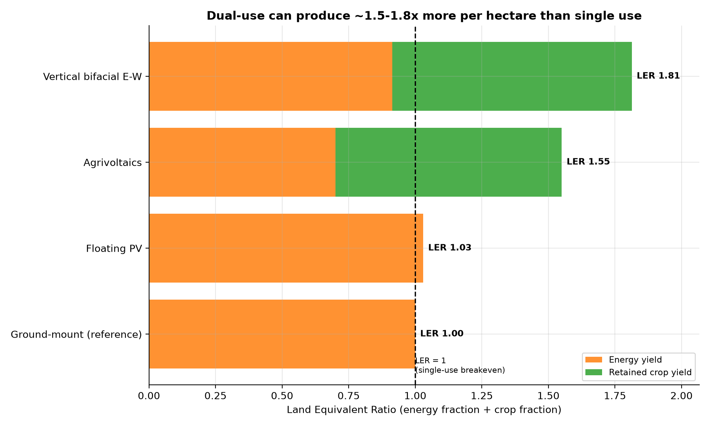
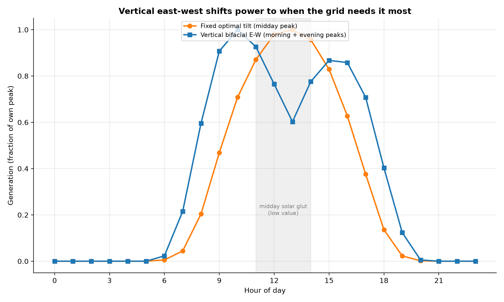

# Optimising for Space: Land, Dual-Use, and Grid Value

*Part IV. Module efficiency (Parts I-III) is energy per square metre of *panel*.
But the constraint that actually bites is energy per square metre of *land* — and
land can often do two jobs at once. This part rethinks **space** itself.*

---

## 1. Why land-use efficiency is the real space metric

A more efficient cell shrinks the panel, but a solar *farm* is mostly the gaps
between rows. What matters for siting is the **Land Equivalent Ratio (LER)**: the
energy a hectare yields plus the crop it still grows, each measured against doing
that one thing alone. LER > 1 means the land is more productive shared than split.

| Archetype | GCR | Yield (kWh/kWp) | kWh/m² land/yr | Crop kept | LER |
| --- | --- | --- | --- | --- | --- |
| Ground-mount (reference) | 0.40 | 1,431 | 119 | 0% | 1.00 |
| Agrivoltaics | 0.28 | 1,431 | 83 | 85% | 1.55 |
| Vertical bifacial E-W | 0.38 | 1,376 | 108 | 90% | 1.81 |
| Floating PV | 0.40 | 1,474 | 122 | 0% | 1.03 |

- **Agrivoltaics** (elevated, widely spaced panels over crops or grazing) reaches
  **LER 1.55** — it gives up some energy density but keeps ~85% of the
  crop, so the shared hectare out-produces either single use. This is the headline
  result of the agrivoltaics literature (LER 1.2-1.7).
- **Vertical bifacial east-west** reaches **LER 1.81**: it yields
  96% of optimal-tilt energy (1,376 kWh/kWp) while
  leaving the land between rows fully farmable.
- **Floating PV** uses *no land at all* and the water's evaporative cooling lifts
  yield about **+3%** versus the same array on a warm roof, while
  cutting reservoir evaporation.

## 2. Space and *time*: the grid-value of vertical east-west

Optimising space is not only about area — it is about *when* the power arrives.
Fixed south-facing panels all peak together at midday, exactly when a grid full of
solar is already glutted and prices crash. Standing the (bifacial) panels vertical
facing east-west moves generation to the morning and evening shoulders:

The vertical array sacrifices a few percent of annual energy for a generation
shape that is worth more per kWh and eases the midday "duck curve". Space
efficiency, properly understood, includes temporal fit to demand.

## 3. Assumptions and limitations

- One site (Greensboro TMY3) and one module efficiency; LER components scale with
  resource and crop choice. Crop-yield fractions are literature mid-points and
  vary widely by species and climate (some shade-tolerant crops exceed open-field
  yield in hot, dry sites).
- Vertical east-west is modelled as a single bifacial module (east face front,
  west face at 0.8 bifaciality); row-to-row shading at low sun angles is captured
  only through the chosen GCR.
- Floating cooling is a flat +3% proxy; real gains depend on water temperature and
  mounting.

## 4. References

- C. Dupraz et al., *Combining solar photovoltaic panels and food crops...*,
  Renewable Energy 36 (2011) — Land Equivalent Ratio for agrivoltaics.
- A. Weselek et al., *Agrophotovoltaic systems: applications, challenges...*,
  Agronomy for Sustainable Development 39 (2019).
- Next2Sun — vertical bifacial east-west field performance.
- World Bank / SERIS, *Where Sun Meets Water: Floating Solar Market Report* (2019).
