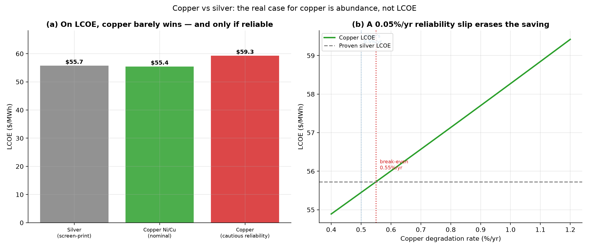

# The Copper Question: Is Silver's Replacement Actually as Good?

*Part XII. Earlier parts called copper metallisation a near-free win — but that was
only ever a cost-and-abundance argument. It never modelled what copper does to a
cell's **efficiency** or **lifetime**. This part closes that gap, and the answer is
more interesting (and more honest) than "copper saves money".*

---

## 1. What copper actually does to a cell

Real engineering, three effects:

- **Efficiency: neutral, even slightly positive.** Copper is only ~6% more
  resistive than silver — negligible. And cells don't use pure silver; they use
  screen-printed silver *paste*, which is less conductive than it sounds.
  Electroplated copper is more conductive than that paste and forms narrower,
  taller lines, so **less of the cell is shaded** and a touch more light gets in.
  Copper-plated cells have matched and even set efficiency records. We model copper
  as marginally *better*, not worse.
- **Longevity: the genuine question.** Copper diffuses into silicon and poisons it
  if it reaches the active layer — so plated copper needs a **barrier** (a nickel
  underlayer; in heterojunction cells the transparent-oxide layer does the job for
  free). Copper also corrodes more readily than silver, so it needs capping and
  good sealing. None of this is fatal — it is solved in the lab and entering mass
  production — but the **field track record is years, not the ~30 silver has**.
- **Cost: a small saving, net of a new process.** Silver removed is worth more than
  the plating added, but the net is modest.

## 2. The like-for-like LCOE

Holding everything else equal and propagating these through the cost-of-energy:

| Metallisation | Metal+process cost | Degradation | Lifetime | LCOE |
| --- | --- | --- | --- | --- |
| Silver (screen-print) | $11.7/kW | 0.50%/yr | 30 yr | $55.72/MWh |
| Copper Ni/Cu (nominal) | $6.2/kW | 0.50%/yr | 30 yr | $55.45/MWh |
| Copper (cautious reliability) | $6.2/kW | 0.65%/yr | 25 yr | $59.29/MWh |

The uncomfortable result: on a whole-system basis, **copper barely wins**. Silver
comes in at **$55.72/MWh** and nominal copper at
**$55.45/MWh** — a difference of cents. And it is fragile:
the moment copper's reliability slips (the "cautious" case: faster degradation, a
25-year life), its cost jumps to **$59.29/MWh** — *more
expensive than proven silver*. The break-even is brutal: copper can tolerate only
about **+0.05 percentage points per year** of extra degradation before the
saving vanishes.

**Why so thin?** Because silver, for all the headlines, is only ~1% of a finished
system's cost. Saving it barely moves the LCOE needle. So if the case for copper
were *only* cost, it would be a coin-flip riding on long-term reliability data we
do not yet have.

## 3. The real reason copper matters

The case for copper was never LCOE. It is **abundance** (Part III). At today's
intensity, silver caps silicon PV at about **1.0 TW/year** of
manufacturing even if solar took half the world's silver. Switch to copper and that
ceiling rises to **~2 TW/year** — effectively unlimited.

So the honest framing is:

- **At the system level**, copper is roughly LCOE-neutral — a small saving that a
  reliability penalty could erase.
- **At the module-maker's level**, silver is a much bigger share of *module* cost
  (not system cost), so the saving is real and is why manufacturers are switching.
- **At the planet's level**, copper is non-negotiable: you simply cannot build
  tens of terawatts a year on silver, at any LCOE.

Copper is not a way to make solar cheaper. It is a way to make solar **possible at
scale** — provided the reliability question, which this model flags but cannot
settle, is closed by field data. That is the honest version of the story the
earlier parts told too breezily.

## 4. Assumptions and limitations

- Efficiency and reliability deltas are representative, not measured; the model's
  job is to show the *sensitivity*, not to certify a product. The conclusion —
  that LCOE is reliability-limited and the real case is abundance — is robust to
  the exact numbers.
- Reliability is modelled as a degradation-rate and lifetime change; real failure
  modes (barrier breakdown, corrosion under damp heat) are lumped into that knob.
- Silver is ~1% of system cost but a larger share of module cost; this part reports
  the system view, which is the conservative one for copper.

## 5. References

- pv magazine (2025-26): copper-metallised HJT matching silver efficiency; LONGi
  beginning copper-module mass production in 2026 as silver prices rose.
- SunDrive: >99% copper-plating production yield.
- ScienceDirect: *Copper metallization of silicon heterojunction cells — process,
  reliability and challenges* (nickel barrier, diffusion, damp-heat).
