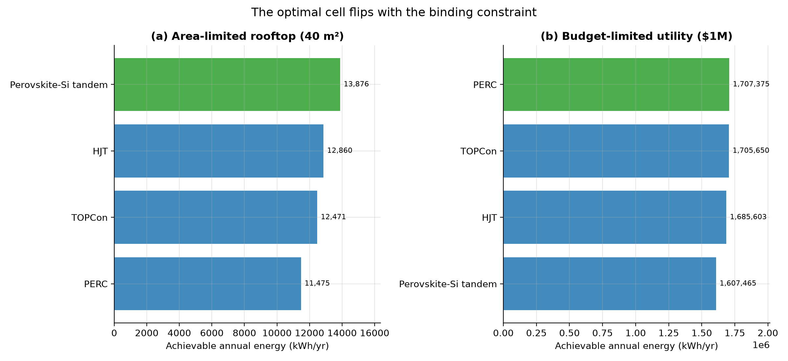

# The Optimiser: Which Cell Wins, and Why

*Part V. Parts I-IV map the trade-offs; this part makes the decision. Given a
budget, an available area, and a goal, the optimiser searches every technology
and deployment and returns the best choice — and, crucially, *which constraint
binds*, so the recommendation is explained rather than asserted.*

---

## 1. The optimal technology is not fixed — it flips with the constraint



**When area binds, efficiency wins.** On a fixed 40 m²
roof, every square metre must work as hard as possible, so the optimiser picks
**Perovskite-Si tandem** — the highest-efficiency cell — delivering
**13,876 kWh/yr** (9.8 kW) even though it costs
the most per watt. Binding constraint: **area**.

| Technology | Deployment | Capacity (kW) | Annual kWh | Cost ($) |
| --- | --- | --- | --- | --- |
| Perovskite-Si tandem | residential | 9.8 | 13,876 | 28,714 |
| HJT | residential | 9.1 | 12,860 | 26,266 |
| TOPCon | residential | 8.9 | 12,471 | 25,511 |
| PERC | residential | 8.3 | 11,475 | 23,598 |


**When money binds, the cheapest energy wins.** With a fixed
$1,000,000 budget and ample land, the optimiser instead
picks **PERC** — the *least* expensive cell — because more dollars
go to capacity, yielding **1,707,375 kWh/yr** (1,111
kW). The premium cell's higher efficiency cannot overcome its higher price here.
Binding constraint: **budget**.

| Technology | Deployment | Capacity (kW) | Annual kWh | Cost ($) |
| --- | --- | --- | --- | --- |
| PERC | utility | 1,111.1 | 1,707,375 | 1,000,000 |
| TOPCon | utility | 1,098.9 | 1,705,650 | 1,000,000 |
| HJT | utility | 1,075.3 | 1,685,603 | 1,000,000 |
| Perovskite-Si tandem | utility | 1,020.4 | 1,607,465 | 1,000,000 |


This flip is the whole point: there is no single "best" cell. Efficiency is
worth paying for exactly when space — not money — is the limiting resource:
rooftops, vehicles, balconies, satellites. For open land, the cheapest reliable
watt wins.

## 2. Lowest cost of energy, overall

Ignoring size and asking only for the cheapest energy, the optimiser returns
**Perovskite-Si tandem at utility scale** at **$54/MWh**
— the utility-scale, high-efficiency combination that anchors the cost frontier.

## 3. How to use it

```python
from solarlab.optimizer import optimize, Constraints
optimize("max_energy", Constraints(area_m2=40, budget_usd=80_000,
                                   deployment="residential"))
optimize("min_cost_for_target", Constraints(target_kwh=10_000, area_m2=40))
```

The optimiser is a thin, transparent layer over the frontier: it sizes each
option against the budget and area, ranks by the chosen objective, and reports
the binding constraint. Swap in a different location's weather, cost stack, or
technology list and the recommendation updates.

## 4. Assumptions and limitations

- Technology module premiums (PERC < TOPCon < HJT << tandem) are typical 2024
  spreads; the *direction* of the flip is robust, the exact crossover budget is
  not.
- One site and one cost stack per deployment; a real quote varies with resource,
  labour, and finance.
- The search space is the discrete frontier (4 technologies x 3 deployments);
  it does not co-optimise tilt, tracking, or storage — those are the levers of
  Parts I and IV.

## 5. References

- Builds on the cost model (Part II, Lazard/NREL) and the system simulation
  (Part I, pvlib). Module price spreads from ITRPV 2024 / market data.
