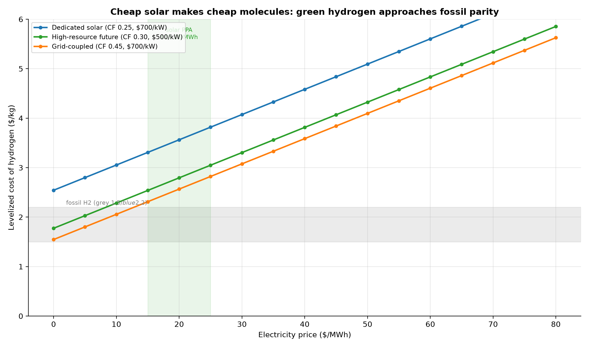
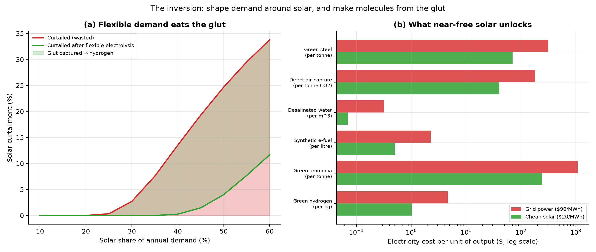

# Solar as Feedstock: Stop Storing Electrons, Start Making Molecules

*Part IX — the deepest reframe in this whole project. Firming (Part VIII) reshapes
**solar** to fit demand. This part does the opposite, and the more powerful thing:
it reshapes **demand** to fit solar. When midday power is nearly free — and
increasingly negative-priced — the winning move is not to store those electrons,
but to build flexible, interruptible industries that feast on them: electrolysers,
direct-air-capture, desalination, smelters, datacenters. Solar stops being a
source of *electricity* and becomes a source of cheap **molecules, heat, water,
and carbon removal**.*

---

## 1. Cheap solar makes cheap molecules

Green hydrogen is the keystone — the gateway from cheap electrons to storable,
shippable, industrial energy. Its cost (LCOH) is dominated by two things: the
electrolyser's capital (amortised over how hard it runs) and the electricity
price (55-70% of the total). Both now point the right way:

At a solar PPA of $20/MWh with a modern electrolyser, the model gives
**$2.79/kg** — inside the 2026 range of $2.50-5 and closing on fossil
("grey") hydrogen at ~$1.50. A subtle but crucial result: hydrogen made *only*
from curtailed midday power is **more** expensive, not less, because a
capital-heavy electrolyser idle 80% of the time can't amortise its cost. The sweet
spot is a flexible electrolyser that runs most of the day on cheap solar and leans
into — not exclusively on — the glut.

## 2. The inversion: demand that eats the glut

Part VII showed that at high penetration a fifth or more of all solar is curtailed.
That waste is not a problem to be mourned — it is a **feedstock to be claimed.**
Add flexible electrolysis that switches on whenever solar floods the grid:

Flexible demand collapses curtailment — at 60% solar share, from a third of all
solar wasted to a small remainder (22 percentage points reclaimed) —
and turns that energy into hydrogen. On a 1000 TWh grid at 45% solar, the
otherwise-spilled glut alone is **~87 TWh/yr**,
enough for **~1.7 million tonnes of hydrogen** — from
energy that was being thrown away. The "duck curve" problem and the "where do we
get green hydrogen" problem are the same problem, and they solve each other.

## 3. What near-free solar unlocks

Because electricity is the dominant input to all of these processes, driving its
price toward zero at midday doesn't just make them cheaper — it makes whole new
industries *possible*. The electricity-cost component of each product at cheap
solar versus grid power:

| Product | Unit | Elec @ $20 solar | Elec @ $90 grid | Market price |
| --- | --- | --- | --- | --- |
| Green hydrogen | kg | $1.02 | $4.59 | ~$4 |
| Green ammonia | tonne | $240.00 | $1,080.00 | ~$600 |
| Synthetic e-fuel | litre | $0.50 | $2.25 | ~$2 |
| Desalinated water | m^3 | $0.07 | $0.32 | ~$1 |
| Direct air capture | tonne CO2 | $40.00 | $180.00 | ~$400 |
| Green steel | tonne | $70.00 | $315.00 | ~$600 |

At grid prices several of these are uneconomic; at $20/MWh solar their energy cost
falls below their market value and they flip to viable. Desalinated water for a few
cents a tonne makes fresh water an energy product. Direct air capture at ~$40/tonne
of electricity makes carbon removal scalable. Green steel and ammonia — a tenth of
all industrial CO2 — decarbonise. **This is how solar changes the energy sphere:
not by lighting bulbs more cheaply, but by becoming the feedstock for the physical
economy whenever the sun is up.**

## 4. Assumptions and limitations

- LCOH uses representative techno-economics (51 kWh/kg, $500-700/kW electrolyser,
  8%/20-yr finance); it reproduces the 2026 $2.50-5/kg range but a real project
  varies with utilisation, location, and stack lifetime.
- End-use intensities are literature mid-points; "viable" depends on full capex and
  logistics, not energy alone — the table isolates the *electricity* component to
  show the unlock, not a complete cost.
- Flexible-demand dispatch is a simple surplus-following heuristic; it captures the
  glut but is not a market or unit-commitment model.

## 5. References

- IEA, *Global Hydrogen Review* (2025-26); BNEF / RMI green-hydrogen cost analyses.
- Electrolyser CAPEX and LCOH 2026: $700-1000/kW falling; LCOH $2.50-5/kg.
- Energy intensities: seawater RO (~3.5 kWh/m^3), DAC (~2 MWh/tCO2), H2-DRI steel
  (~3.5 MWh/t), Haber-Bosch ammonia (~12 MWh/t incl. hydrogen).
