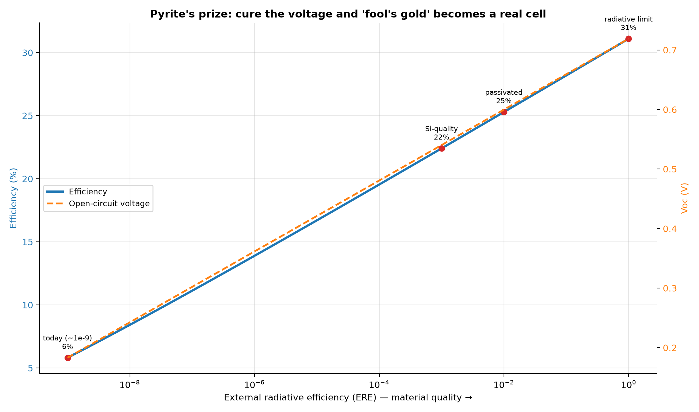

# Fool's Gold: The Pyrite Voltage Problem, and the Prize for Solving It

*Part VI. Part III argued that abundant-element cells are what let solar scale to
tens of terawatts. The most abundant candidate of all is **iron pyrite (FeS₂)** —
iron and sulfur, essentially unlimited and nearly free. It has a near-ideal
0.95 eV bandgap and absorbs sunlight ferociously. And yet it makes
a terrible solar cell. This part models exactly why — and what cracking it would
unlock.*

---

## 1. The paradox

By the Shockley-Queisser logic of Part I, pyrite's 0.95 eV bandgap
should support a radiative efficiency limit of **31%**
(open-circuit voltage **0.72 V**). Real pyrite cells have never
exceeded ~3%, with open-circuit voltages stuck near **0.2 V** — a catastrophic
collapse no other near-ideal-bandgap material suffers.

## 2. The diagnosis: a voltage problem, quantified

The collapse is not about absorbing light (pyrite absorbs superbly) — it is about
*holding voltage*. Non-radiative recombination — from sulfur vacancies, surface
states, and a possible conductive surface phase that pins the Fermi level — drains
the photovoltage. The Shockley-Queisser model captures this with one parameter,
the **external radiative efficiency (ERE)**: the dark current scales as
`J0 = J0_radiative / ERE`, so the voltage falls by `kT·ln(ERE)`.

Pyrite's ERE is around **1e-9** — billions of times worse than a GaAs record cell
(~0.2). That single number costs **0.54 V** of open-circuit
voltage and drops the efficiency ceiling from 31% to just
**5.8%** — and real cells fall short of even that, once shunting
and series resistance (not modelled here) are added.

## 3. The prize

The figure's message is the whole point: efficiency climbs steadily with material
quality — about **3 percentage points for every decade of ERE**, because each
decade adds `kT·ln(10) ≈ 0.06 V` of open-circuit voltage. Pyrite today sits at the
very bottom-left; it needs to climb roughly **five to six decades** of ERE to
become useful. Move it up to merely **silicon-grade** material quality and the
model gives:

| Material quality | Voc (V) | Efficiency |
| --- | --- | --- |
| Observed today (ERE ~1e-9) | 0.18 | 5.8% |
| Silicon-quality (ERE 1e-3) | 0.54 | 22.4% |
| Passivated (ERE 1e-2) | 0.60 | 25.3% |
| Radiative ceiling (ERE 1) | 0.72 | 31.1% |

A passivated pyrite cell could reach **25%** — competitive
with today's commercial silicon — built from two of the cheapest, most abundant
elements on Earth. Combine that with Part III: pyrite's deployment ceiling is
effectively **unlimited** (iron and sulfur are mined in billions of tonnes per
year). A 20%-efficient pyrite cell would be worth more to the energy transition
than a 35%-efficient tandem that indium can never scale.

## 4. Why it is hard, and what would crack it

The voltage problem is widely attributed to the pyrite *surface* (a sulfur-poor,
metallic-like layer) and to bulk sulfur vacancies. The levers are the same ones
that tamed silicon and perovskites: surface passivation, precise stoichiometry
control, and grain/interface engineering — raising ERE by the ~5 orders of
magnitude that stand between today's cells and the cliff edge. This is a
materials-science moonshot, not a thermodynamic impossibility: the physics
permits 31%; only the defects forbid it.

## 5. Assumptions and limitations

- The ERE model captures the *voltage* loss (the dominant, defining failure) but
  assumes ideal current collection and no shunt/series losses, so it is an upper
  bound — real pyrite trails even the 5.8% shown for ERE 1e-9.
- ERE values are representative (pyrite ~1e-9; GaAs ~0.2; Si ~1e-3); the
  qualitative cliff and the size of the prize are robust to the exact figures.
- One bandgap (0.95 eV) and the standard AM1.5G spectrum.

## 6. References

- M. A. Green, *Radiative efficiency of state-of-the-art photovoltaic cells*,
  Prog. Photovolt. 20 (2012) — the ERE framework.
- W. Shockley & H. J. Queisser, J. Appl. Phys. 32, 510 (1961).
- Pyrite photovoltaics reviews (surface states / sulfur-vacancy voltage deficit),
  e.g. Wadia/Alivisatos abundance analysis; Hu et al. on FeS₂ defect physics.
