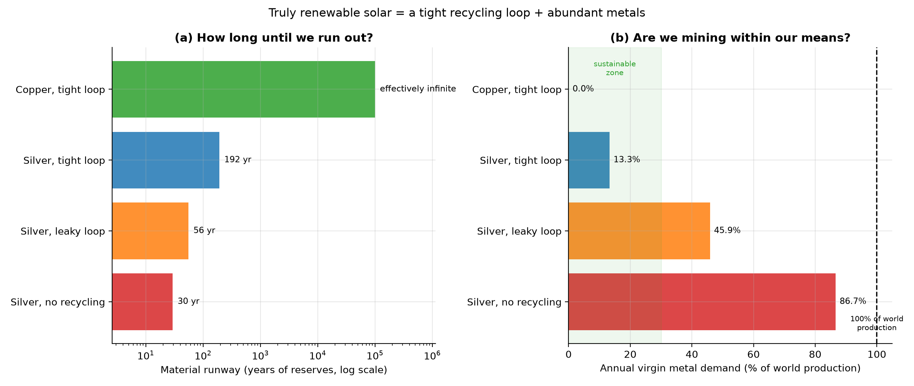

# Can Solar Be Truly Renewable?

*Part XIII. "Renewable" usually means the *fuel* is endless — and sunlight is. But a
solar panel is built from *metals*, and metals are mined. So a fair sceptic asks:
if every panel needs silver, won't we eventually run out, and isn't calling that
"renewable" a sleight of hand? This part takes the objection seriously and answers
it with arithmetic.*

---

## 1. First, the good news: metals don't wear out

A crucial fact that decides everything below: **metals are infinitely recyclable.**
Unlike a plastic bottle (which "downcycles" into something lower-grade) or a sheet
of glass (usually crushed for roadbed), the silver and copper in a retired solar
panel can be refined back to **original, cell-grade purity** and used again in a
brand-new panel, with no loss of quality. Silicon, too, can be re-purified to solar
grade (it costs energy, but solar has energy to spare). The recovered metal is not a
downgrade — it is the same atom, ready to work for another thirty years.

So the only thing lost each cycle is what we **fail to collect or recover**. With a
realistic chain — 90% of panels collected, 95% of the metal recovered, 99%
surviving refining — about **85% of the metal comes back**
each ~30-year cycle. The other ~15% is the leak we must replace with fresh mining.

## 2. Now the hard question: do we run out?

Imagine a *mature* world running on **50 terawatts** of solar — enough to power a
fully electrified civilization. Each year it retires and rebuilds about a thirtieth
of itself. How much metal does that take, and how long can the Earth supply it?

| Scenario | Loop closed | Virgin metal/yr | % of world prod. | Runway |
| --- | --- | --- | --- | --- |
| Silver, no recycling | 0% | 21,667 t | 86.7% | 30 years |
| Silver, leaky loop | 47% | 11,478 t | 45.9% | 56 years |
| Silver, tight loop | 85% | 3,327 t | 13.3% | 192 years |
| Copper, tight loop | 85% | 3,839 t | 0.0% | effectively infinite |

The numbers tell a sharp story:

- **Silver, no recycling:** a 50 TW silver-based fleet would consume **87% of all
  the silver mined on Earth every year**, and exhaust known silver *reserves* in
  about **30 years**. Called that way, the
  sceptic is right — this is *not* renewable. It's a 30-year resource cliff.
- **Silver, tight recycling loop:** close the loop to ~85% and fresh silver demand
  collapses to **13% of world production**, stretching
  the runway to about **192 years**. Recycling doesn't
  just help — it converts an unsustainable system into a multi-century one.
- **Copper, tight loop:** copper-based metallisation (Part XII) needs only
  **0.02% of world copper production**, against reserves so
  large the runway is **effectively infinite**.

## 3. The verdict: yes — on two conditions

So can solar be *truly* renewable? **Yes, but it is a choice, not an automatic
property**, and it rests on two pillars:

1. **Close the loop.** Recycling is not optional housekeeping; it is the difference
   between a 30-year cliff and a multi-century supply. And because the recovered
   metal returns to full purity, the loop genuinely closes — this is real
   circularity, not a slogan. The danger is a *leaky* loop: poor collection (panels
   abandoned, exported, landfilled) drops you back toward the cliff.
2. **Move to abundant metals.** Even a perfect loop on silver is *finite* — every
   cycle leaks ~15%, so reserves still drain, just slowly. Only a shift to abundant
   materials (copper, aluminium, iron, silicon — the stuff of Parts VI and XII)
   makes the runway effectively endless. That is what "truly renewable" actually
   requires.

The scarce-silver era we are in now is best understood as a **bootstrap**: it gets
solar started, but a civilization that intends to run on solar *forever* must
graduate to abundant materials and a tightly closed loop. Do both, and solar earns
the name "renewable" in the fullest sense — not just an endless fuel, but an endless
*material* basis too. Do neither, and we simply trade an oil cliff for a silver one.

## 4. Assumptions and limitations

- A simplified steady-state (non-growing) 50 TW fleet on a 30-year lifetime; during
  *growth*, demand is higher and scarcer (Part III). The steady state is the
  long-run question this part addresses.
- Recovery chain figures (collection/recovery/refining) are representative; real
  collection rates today are far below 90%, which is precisely the risk.
- "Reserves" are economically-recoverable today; they grow as prices rise and
  exploration continues, so the silver runways are conservative — but the
  *direction* (scarce = finite, abundant = endless) is robust.

## 5. References

- USGS Mineral Commodity Summaries 2025 (production, reserves).
- IEA / IRENA on PV material circularity and end-of-life recovery.
- Metal recyclability and refining-to-purity: standard hydro/pyrometallurgy.
