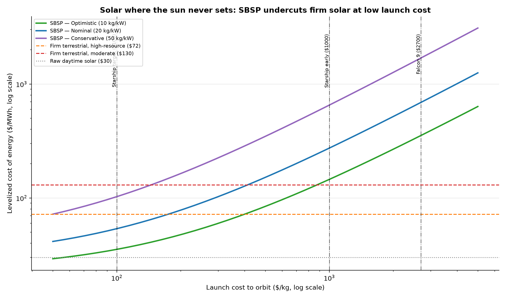

# Solar Off-World: Escaping Intermittency by Leaving the Planet

*Part X — the third and most radical answer to the value wall. Firming (VIII) and
power-to-X (IX) work around the night. Space-based solar power (SBSP) **abolishes**
it. In geostationary orbit the sun never sets and no atmosphere dims it, so a solar
satellite delivers ~95% capacity factor at ~1361 W/m² — then beams the power to a
ground rectenna by microwave. It is the only solar that is firm by nature.*

---

## 1. The right comparison

SBSP is often dismissed by comparing it to dirt-cheap daytime solar (~$30/MWh) —
which is unfair, because SBSP delivers power around the clock. The honest
benchmark is **firm** terrestrial solar from Part VIII (~$72/MWh at high-resource
sites, ~$130 at moderate ones). Against that bar, the only question is launch cost,
because the cost of an SBSP system is dominated by the mass it must lift to orbit.

## 2. The launch-cost threshold

Modelling SBSP LCOE as (annualised launch + hardware) / round-the-clock energy,
across satellite-mass scenarios:

| Satellite mass | LCOE @ Starship ($100/kg) | LCOE @ Falcon 9 ($2700/kg) | Launch cost to beat firm solar |
| --- | --- | --- | --- |
| Optimistic (10 kg/kW) | $35/MWh | $354/MWh | $399/kg |
| Nominal (20 kg/kW) | $54/MWh | $690/MWh | $175/kg |
| Conservative (50 kg/kW) | $103/MWh | $1694/MWh | $50/kg |

The result is decisive. At today's Falcon 9 prices (~$2700/kg) SBSP is hopeless —
hundreds to thousands of dollars per MWh. But the curve is steep, and at **Starship's
target of ~$100/kg** the nominal design lands at **$54/MWh**
— below firm terrestrial solar. The break-even launch cost to beat high-resource
firm solar is **~$175/kg** for the nominal case (and as
high as a few hundred $/kg for ultralight designs). That is precisely the range the
next generation of reusable heavy-lift rockets is targeting.

This reframes SBSP from science fiction to a **launch-cost bet**. It does not need
a physics breakthrough; it needs the cost of reaching orbit to fall by ~20-50×,
which is already underway. Caltech's flight demonstration of in-space power beaming
(2023), ESA's SOLARIS, and China's planned megawatt test station are the opening
moves. Reproduced here: Caltech's own ~$0.09/kWh estimate sits squarely on our
nominal curve.

## 3. Why it could change the sphere of energy

If launch costs fall as projected, SBSP offers something no terrestrial system
can: **gigawatt-scale, 24/7, weather-proof, land-free power deliverable anywhere a
rectenna can be built** — including places with poor sun, high latitudes, or no
land to spare. It is firmness without storage, baseload without fuel. It would not
replace cheap terrestrial solar for daytime bulk energy; it would compete for the
high-value firm capacity that Parts VII-VIII showed is the hard, expensive part.
The sun delivers ~10¹⁷ W to Earth's vicinity; we have, so far, only ever reached up
and taken a little of what misses the planet entirely.

## 4. Assumptions and limitations

- A deliberately simple cost model: LCOE = (CRF·(specific_mass·launch + hardware) +
  opex) / annual delivered energy. Specific mass (10-50 kg/kW ground-delivered) and
  hardware cost fold in beam efficiency (~50% DC-RF-DC), pointing, and the ground
  rectenna. These are the central uncertainties.
- Ignores orbital assembly, station-keeping, space-debris and radiation
  degradation, spectrum/safety regulation, and end-of-life — all real, none
  obviously fatal.
- The break-even is against *our* firm-terrestrial numbers (Part VIII); cheaper
  long-duration storage would raise the bar SBSP must clear.

## 5. References

- Caltech Space Solar Power Project (MAPLE in-space beaming demo, 2023);
  Atwater et al. LCOE estimates ($0.09-0.50/kWh).
- ESA SOLARIS; China 2030 MW test-station plan; UK/Japan SBSP roadmaps.
- Starship LEO launch-cost targets (~$100/kg) enabling the threshold here.
