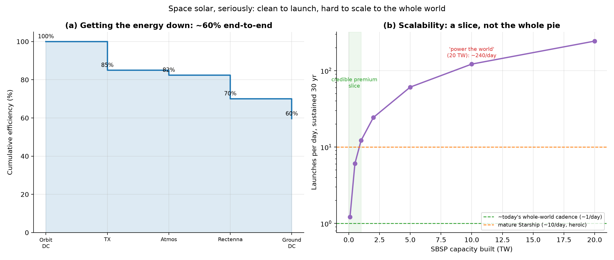

# Space Solar, Seriously: The Climate, the Beam, and the Scale

*Part XV. Part X reframed space-based solar (SBSP) as a launch-cost bet. That was
the economics. This part answers the *physical* questions a sceptic rightly asks —
what does it cost the climate to launch, how do you actually get the energy down,
what happens to dead satellites, what about debris, and the big one: could it power
the whole world?*

---

## 1. The climate cost of launching it

Rockets burn fuel, so it's fair to ask whether an SBSP satellite ever pays back its
launch emissions. The answer is: easily, and fast.

A satellite massing ~20 kg per kW of ground power, launched at ~20 kg of CO₂ per kg
to orbit, carries roughly **900 kg of CO₂ per kW** of
embodied carbon (launch plus manufacturing). Spread over a 20-year life at ~95%
capacity factor, that is just **5.4 g CO₂ per kWh** —
*cleaner per kilowatt-hour than terrestrial solar* (~25-40 g/kWh), because orbital
panels run almost continuously and amortise their carbon over far more energy. The
**carbon payback is about 3 months**.

One honest caveat the simple number misses: a heavy launch cadence injects soot and
water vapour directly into the stratosphere, whose warming and ozone effects are
poorly quantified and *not* captured by CO₂ accounting. Launch *carbon* is a
non-issue; launch *cadence* at scale is a real, open environmental question.

## 2. How you actually get the energy down

The satellite's panels make DC electricity in orbit; a transmitter converts it to
microwaves (typically 5.8 GHz), beams it to a ground "rectenna" (a mesh of little
antennas), which rectifies it back to DC. Each step loses a little:

| Step | Efficiency |
|---|---|
| DC -> microwave (transmitter) | 85% |
| Beam through atmosphere (5.8 GHz) | 97% |
| Rectenna capture (pointing/spillover) | 85% |
| Microwave -> DC (rectifier) | 85% |

End to end, about **60%** of the power made in orbit reaches the grid —
which is why Part X folded a ~50% factor into the satellite's effective cost. The
microwave beam is deliberately *diffuse* (safety-limited to a couple of hundred
watts per square metre, far below sunlight), so the rectenna is large but
low-intensity — a mesh you can farm or graze beneath, not a death ray.

## 3. End-of-life, debris, and maintenance

- **Dead satellites.** Unlike a terrestrial panel — which becomes the "urban mine"
  of Part III — an SBSP satellite in geostationary orbit is nearly impossible to
  recycle. The convention is to boost it to a "graveyard" orbit at end of life.
  This is a genuine downside: **SBSP is not materially circular.** Its materials are
  effectively lost, which argues for building it from common, non-scarce elements.
- **Meteoroids and debris.** Large, thin, kilometre-scale structures are exposed to
  micrometeoroids and orbital debris. The saving grace is *modularity*: an SBSP
  array is millions of identical small elements, so a strike degrades output by a
  sliver rather than destroying the asset — the same redundancy logic as a
  terrestrial farm. Geostationary orbit is also far less debris-crowded than low
  Earth orbit.
- **Maintenance.** No humans. The plan is robotic servicing and modular replacement
  — feasible in principle, unproven at scale, and one of the larger engineering
  risks alongside in-orbit assembly.

## 4. Could it power the whole world?

This is where the honesty matters most. The binding constraint is not cost or
carbon — it is **mass to orbit**.

| SBSP built | Mass to orbit | Launches | Launches/day (30 yr) | Rectenna area |
| --- | --- | --- | --- | --- |
| 0.1 TW | 2 Mt | 13,333 | 1.2 | 667 km² |
| 1.0 TW | 20 Mt | 133,333 | 12.2 | 6,667 km² |
| 5.0 TW | 100 Mt | 666,667 | 60.9 | 33,333 km² |
| 20.0 TW | 400 Mt | 2,666,667 | 243.5 | 133,333 km² |

Building **1 TW** of SBSP would take ~133,333 launches —
**~12 per day, every day, for 30 years.** That is
already at the heroic edge of what a mature, fully-reusable Starship fleet might
sustain. Powering the *whole* electrified world (~20 TW) would
demand **~244 launches per day** and
**400 million tonnes** lifted to orbit — far beyond any
plausible launch industry this century.

So the verdict is clear and unromantic: **SBSP cannot be the bulk of the world's
energy.** But it does not need to be. Its natural role is the **premium slice** that
terrestrial solar is *worst* at — the firm, 24/7, weather- and night-proof power
that Parts VII and VIII showed is the hard, expensive part of a solar grid. A few
hundred gigawatts of always-on space power, delivered to high-latitude cities,
remote industry, or disaster zones, is both physically credible and economically
valuable. SBSP is not a replacement for the sun on our roofs; it is a complement for
the hours the roof is dark.

## 5. Assumptions and limitations

- Launch carbon uses ~20 kg CO₂/kg to orbit and a ~500 kg CO₂/kW manufacturing
  term; both are order-of-magnitude. The stratospheric (non-CO₂) effects of high
  cadence are deliberately excluded and flagged as a real unknown.
- The beaming chain uses representative stage efficiencies; real systems will vary.
- Scalability assumes 20 kg/kW and 150 t/launch; lighter satellites or larger
  vehicles help linearly but do not change the qualitative "slice, not all" verdict.

## 6. References

- NASA / ESA SOLARIS / Caltech SSPP technical studies on beaming and architecture.
- Launch-emissions analyses (rocket CO₂ and stratospheric soot literature).
- Microwave power transmission and rectenna safety standards (~2.45/5.8 GHz).
