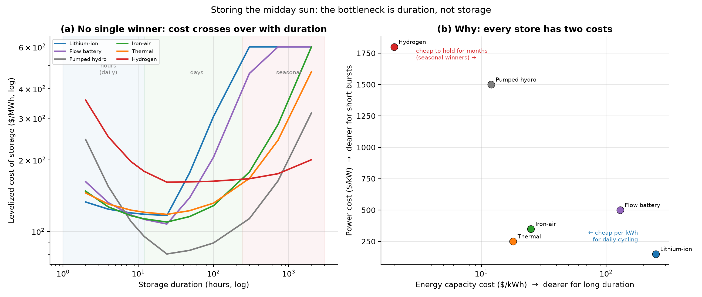

# Storing the Midday Sun: The Bottleneck Is Duration, Not Storage

*Part XVII. Part VII showed solar's curse — it floods the market at noon, when power
is worth least. Part VIII firmed it with a battery and hit a cost cliff at high
reliability. This part opens that black box: *which* storage, and *why* the cliff is
there. The answer reframes "the storage problem" into something more precise and
more solvable.*

---

## 1. Every store has two costs — and that decides everything

The single idea that unlocks storage: a store is priced in **two** numbers, not one.

- **Power** (\$/kW): how fast it can charge and discharge.
- **Energy** (\$/kWh): how much it can hold.

A lithium battery is cheap on power but **expensive on energy** (~\$250/kWh of
capacity) — wonderful for a few hours, ruinous for a few weeks. A hydrogen system is
the mirror image: expensive on power (you need an electrolyser *and* a fuel cell)
but its energy capacity — hydrogen in a salt cavern — costs almost nothing
(~\$2/kWh). So the cheapest way to store solar depends entirely on **how long** you
need to hold it.

## 2. There is no single best storage — it crosses over

Computing the levelized cost of storage (LCOS) across durations, the winner changes
as you go from hours to seasons:

| Duration | Cheapest storage | LCOS | Material base |
| --- | --- | --- | --- |
| 4 h | Lithium-ion (LFP) | $124/MWh | Li moderate / Fe-P abundant |
| 12 h | Pumped hydro | $95/MWh | abundant, geography-limited |
| 24 h | Pumped hydro | $80/MWh | abundant, geography-limited |
| 4 days | Pumped hydro | $89/MWh | abundant, geography-limited |
| 1 months | Pumped hydro | $163/MWh | abundant, geography-limited |
| 3 months | Hydrogen (cavern) | $200/MWh | abundant, cavern-limited |

Read it as three regimes:

- **Hours (daily shifting):** **lithium-ion** wins — high efficiency (~90% round
  trip) and falling fast. This is the part that is *solved*; it is why batteries are
  booming. (Pumped hydro is even cheaper where the geography exists — two reservoirs
  and a hill — but the good sites are largely taken, which is exactly why batteries,
  buildable anywhere, are filling in.)
- **Days (the multi-day gap):** the cheap-energy technologies take over — **iron-air**
  (rusting and un-rusting iron), **thermal** (heating cheap rock or salt). They waste
  more energy per cycle, but they cycle rarely, so what matters is the cost to *hold*.
- **Weeks to seasons:** only **hydrogen** (or its cousins) is cheap enough to hold
  energy from summer to winter. Lithium here is absurd — its cost explodes from
  **$124/MWh at 4 hours to $5018/MWh at three months.**

## 3. The bottleneck, named

That explosion *is* the cliff from Part VIII. Solar's surplus comes in two rhythms:
a **daily** one (noon to night, a few hours) and a **seasonal** one (sunny summer to
dark winter, months). Lithium has all but solved the daily problem. **The bottleneck
is everything longer** — the multi-day "dunkelflaute" (windless, cloudy stretches)
and the seasonal swing — where lithium's \$/kWh is hopeless and the cheap
alternatives (iron-air, thermal, hydrogen) are still young and unproven at scale.
This is the single most important place to push: not better batteries for hours, but
dirt-cheap capacity for **days and seasons.**

## 4. Two findings that flip the conventional wisdom

**First — when the energy is free, efficiency stops mattering.** The usual case for
lithium is its high round-trip efficiency. But solar's midday surplus is increasingly
*curtailed* — thrown away for nothing (Part VII). If your input energy is free, you
don't care that a thermal store wastes half of it. In that regime the model flips:
storing **free curtailed solar** makes the cheap-capacity technologies win even at
short duration — thermal storage delivers around **$20/MWh
at a full day's duration.** Efficiency is a virtue only when the input is valuable.

**Second — the cheapest "storage" is often not storage at all.** This is where the
whole project converges. Rather than store midday electrons (losing 10-50% and paying
for the box), you can **use them the instant they arrive** — the demand-shifting of
Part IX — or store the *product* instead of the electricity: hydrogen, heat, and
fresh water are all far cheaper to hold than electrons. "Store the molecule, not the
electron" is usually the right answer for long duration, which is why Parts IX and
XVII are really the same idea seen from two sides.

## 5. And the recurring lesson returns: abundance

The materials theme that runs through this whole project reappears in storage. Lithium
and vanadium are supply-constrained (and lithium competes with every electric car);
**iron-air, thermal mass, sodium, and hydrogen are built from some of the commonest
stuff on Earth.** For storage that must scale to terawatt-weeks of capacity, the same
rule holds as for the panels themselves: *bet on abundant materials.* The future grid
likely stores its hours in lithium, its days in iron and heat, and its seasons in
hydrogen — a portfolio, matched to duration, and chosen for what the Earth has plenty
of.

## 6. How humanity stores the midday sun, better

1. **Match the technology to the duration** — lithium for hours, iron-air/thermal for
   days, hydrogen for seasons. Using one tool for all of it is the central mistake.
2. **Pour research into long-duration, abundant-material storage** — that is the
   bottleneck and the prize.
3. **Shift demand instead of storing** wherever possible (electrolysers, heat,
   desalination that run at noon), and **store the molecule, not the electron** for
   the rest.
4. **Stop wasting the free input** — curtailed midday solar is the cheapest charging
   energy that will ever exist; the storage that captures it need not be efficient,
   only cheap to build.

## 7. Assumptions and limitations

- LCOS uses representative 2026 installed costs and efficiencies; real projects vary
  widely, and several long-duration technologies are pre-commercial (their costs are
  targets, not track records).
- Cycling is modelled as a function of duration; pumped hydro's geography limit is
  flagged but not modelled numerically, so it looks more universally available than
  it is.
- A single charge price stands in for a whole market; the report's own sensitivity
  (free vs $50/MWh charging) shows how much that assumption matters.

## 8. References

- NREL / BNEF / LDES Council storage cost and LCOS-vs-duration analyses.
- Form Energy (iron-air, ~100 h); Antora / Rondo (thermal); salt-cavern hydrogen
  storage literature; pumped-hydro resource assessments.
