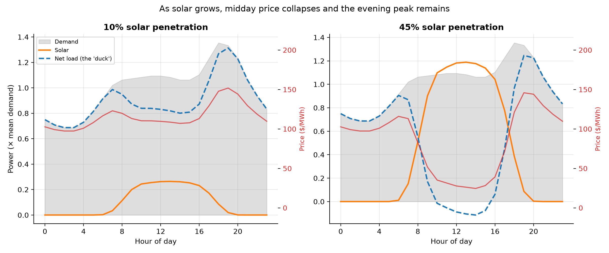

# The Value of Time: Why Cheap Solar Is Not the Same as Valuable Solar

*Part VII, and the hinge of the whole project. Parts I-VI made solar **cheap** and
showed how to make it **abundant**. This part confronts the problem that is
actually slowing solar down in 2026 — not cost, not materials, but **value**. A
kilowatt-hour is not a kilowatt-hour: one at the evening peak is worth many times
one during the midday glut, and solar produces a flood of the latter. Every metric
in this report is computed on the hourly engine; LCOE is deliberately absent,
because LCOE is the metric that hides this problem.*

---

## 1. The integration wall

LCOE treats every kilowatt-hour as identical. Markets do not. We model an hourly
merit-order price that rises with **net load** (demand minus solar) and collapses —
even goes negative — when solar oversupplies. Then we raise solar's share of
annual demand from 0 to 60% and watch what each kilowatt-hour actually earns:

| Solar share | Value factor | Capture price ($/MWh) | Curtailment |
| --- | --- | --- | --- |
| 0% | 1.07 | $133 | 0% |
| 10% | 0.94 | $108 | 0% |
| 20% | 0.79 | $85 | 0% |
| 30% | 0.55 | $53 | 3% |
| 40% | 0.30 | $26 | 14% |
| 50% | 0.19 | $15 | 25% |

At low penetration solar is *more* valuable than the average kWh (value factor
**1.07**) — it generates during high-demand daylight. But it is the
victim of its own success: by **~30%** share the value factor falls to
**0.55**, and by **~45%** to **0.24**, with **19%**
of all solar spilled as curtailment. This is not a forecast — it is already
visible: Germany's solar capture rate fell from 73% to 48% between 2023 and 2025,
California's solar value is down 37% since 2014, and 2026 is on track to be the
first year global solar additions *fall*. **The wall is value, not cost.**

## 2. The duck and its teeth

The mechanism is the "duck curve": solar carves a midday trough out of net load,
so the residual demand that sets the price is pushed into the evening, when the sun
is gone. Compare an average day at low vs high penetration:

At **10%** solar barely dents the price. At **45%**
the midday price craters toward zero while the **evening peak is untouched** — solar
cannot reach it. The cruel arithmetic: the more solar you build, the less each new
panel earns, and the more you must throw away. Left alone, this caps solar far
below 100% of the grid no matter how cheap panels get.

## 3. Why this changes everything

This is the pivot of the entire analysis. For a century we built **dispatchable**
supply (coal, gas) that followed demand. Solar cannot follow demand — its timing is
fixed by the sun. So the old question, *"how do we make solar cheaper?"*, is
answered; the new question is *"how do we make solar's energy useful when it
arrives?"* There are exactly three answers, and the next three parts model each:

- **Firm it** — store the midday glut for the evening peak (Part VIII).
- **Feed it** — build flexible demand that feasts on cheap midday power: hydrogen,
  fuels, heat, desalination, compute (Part IX).
- **Escape it** — collect where the sun never sets: orbit (Part X).

The unifying move is an **inversion**: stop shaping solar to fit demand, and start
shaping demand to fit solar.

## 4. Assumptions and limitations

- The price model is a transparent stylised merit order (price rises with net load,
  negative on oversupply); it reproduces the *shape* and magnitude of observed
  capture-rate decline but is not a market simulation.
- One demand profile (evening-peaking, mild seasonal) and one site's solar shape.
- No storage, flexibility, exports, or demand response — deliberately. This is the
  *unmitigated* problem; Parts VIII-IX add the mitigations.

## 5. References

- Real capture-rate / value-factor data: California ISO, German market (Energy
  Charts / Fraunhofer ISE), 2023-2025.
- Lion Hirth, *The market value of variable renewables*, Energy Economics 38 (2013).
- pv-magazine / GEM Energy Analytics: 2026 global solar growth inflection.
